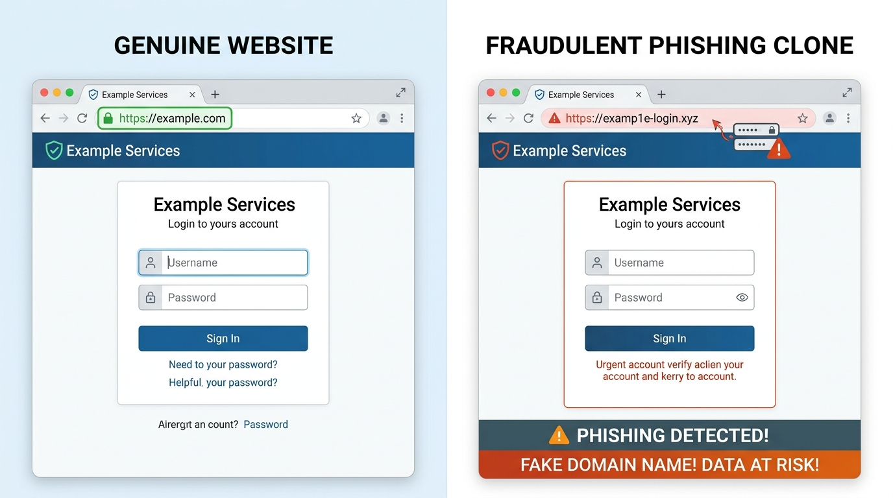

# 第1部：認証と個人のセキュリティー

### 本日の講義アジェンダ —— アカウントとスマホを守る

#### 🗺️ 本日のアジェンダ（全4テーマ）
1. **パスワードはなぜ破られるのか？**（脆弱な合言葉と最新の攻撃手法）
2. **二重の鍵をかける —— 多要素認証と生体認証**（OTP・生体情報の真実）
3. **パスワードが消える？ —— パスキーの登場**（フィッシング完全防御の公開鍵暗号）
4. **ソーシャルログインの落とし穴**（OAuthの仕組みと連鎖凍結リスク）

---

### 本日の到達目標

#### 🎯 本日の講義で身につく力
* パスワード解読手口（ブルートフォース・スプレイ・漏洩リスト）と最新の防御策を説明できる
* 2要素認証（SMS/TOTP）と生体認証の仕組み・弱点・自衛策を実践できる
* パスキーが「なぜ偽サイトを100%無効化できるのか」を理解できる
* アプリ連携（ソーシャルログイン）時の権限リスクを適切に見直せる


---

---

## 1. パスワードはなぜ破られるのか？

### 考えてみたい問い

* なぜ「定期変更」は推奨されなくなった？
* 「パスワードを忘れた」を押した時、なぜ今のパスワードを教えてくれない？
* スマホの画面ロックを覗かれると何が起きる？
* 過去のパスワード漏洩を調べる方法はある？

---

### カギを開ける人と部屋を使う人 —— 認証と認可

#### 🔑 2つの言葉の違い
* **認証（あなた誰？）**
  * 本人確認。「私は山田太郎です」と証明する。
  * 例：ID・パスワード入力、顔認証。
* **認可（何していい？）**
  * 権限の付与。「何ができるか」のルール。
  * 例：山田さんは「自分の成績」は見られるが「他人の成績」は見られない。

---

### 【たとえ話】🏨 ホテルの宿泊でたとえると？

::: {.callout-tip title="🏨 ホテルの宿泊でたとえると？"}
* **認証**：フロントで身分証を見せて「予約した山田です」と名乗り、**カードキーをもらうこと**。
* **認可**：そのカードキーで**「301号室は開くが、隣の部屋や従業員室は開かない」**という鍵の権限設定のこと！
:::

---

### 【図解】認証と認可の連携シーケンス
```{mermaid}
sequenceDiagram
    autonumber
    participant U as "ユーザー (山田さん)"
    participant S as "認証サーバー (フロント)"
    participant R as "成績管理DB (客室エリア)"
    U->>S: ID/パスワード送信 (認証：チェックイン)
    S-->>U: ログイン成功 (301号室カードキー発行)
    U->>R: 成績閲覧リクエスト (ドアにかざす)
    Note over R: 権限チェック<br/>(山田さんの部屋のみ解錠：認可)
    R-->>U: 成績データを返却
```

::: {.callout-tip title="📱 利用者の自衛ポイント"}
アプリ連携時に「プロフィールの取得」だけでなく「勝手な投稿」「友達リストの取得」など、過剰な権限（認可）を要求されていないか必ず確認しましょう。
:::

---

### 攻撃者はどうやってパスワードを当てるか？

#### 🔨 主な攻撃手法
* **総当たり（ブルートフォース）**
  * あらゆる文字列を片っ端から試す。
* **辞書攻撃**
  * 誕生日、人名、`password` などの頻出リストを優先照合。
* **リスト型攻撃（最凶の脅威）**
  * 他所で流出したID・パスワードを使い、Amazonやメルカリへ自動ログインを試行。

---

### パスワード使い回しの危険性 —— 「すべての部屋を同じ合鍵にする」恐怖

::: {.callout-danger title="🚨 パスワード使い回しの本質"}
パスワードの使い回しは、**「自宅の玄関、実家、ロッカーの鍵をすべて同じ合鍵にして持ち歩く」**のと同じです。  
どこか1箇所の通販サイトから漏れた瞬間、すべての部屋が一斉に開けられます。
:::

---

### 【図解】リスト型攻撃の拡散メカニズム
```{mermaid}
flowchart TD
    A["中小ECサイト漏洩事故"] -->|ID/Pass流出| B[("ダークウェブ流通")]
    B --> C["攻撃者の自動スクリプト"]
    C -->|同じID/Passで試行| D["メルカリ"]
    C -->|同じID/Passで試行| E["Amazon"]
    C -->|同じID/Passで試行| F["Apple ID"]
    D -->|ログイン成功| G["💥 不正購入・乗っ取り被害"]
    style G fill:#ffcdd2,stroke:#d32f2f
```

---

### 最新の脅威：画面ロックPIN覗き見からの「全乗っ取り」

#### 📱 カフェやバーで多発する手口
1. 背後からスマホのロック解除PIN（4〜6桁）を盗み見る。
2. スマホ本体をスリ盗る。
3. ロック解除後、**「設定」からApple ID等のパスワードを変更！**
4. 復旧キーを再生成し、被害者を自分のアカウントから永久に締め出す。
5. 銀行アプリやApple Payから預金を全額引き出す。

---

### 【図解】PIN覗き見からの全口座乗っ取りフロー

```{mermaid}
flowchart TD
    A["① カフェ等でPINコード覗き見"] --> B["② スマホ本体のスリ・盗難"]
    B --> C["③ 画面ロック解除後に設定からPass変更"]
    C --> D["④ 復旧キーを勝手に再作成<br/>(被害者をアカウントから永久追放)"]
    D --> E["💥 銀行・Apple Payから預金全額送金被害"]
    style A fill:#fff3e0,stroke:#f57c00
    style E fill:#ffebee,stroke:#c62828,stroke-width:2px
```

---

### 【対策】iPhone「盗難デバイスの保護」設定

#### 🛡️ 救世主機能の仕組み
* 自宅や職場以外の見知らぬ場所では：
  * **パスコードによる回避を禁止**（Face ID / Touch IDが必須）。
  * パスワードや復旧キー変更に**1時間の遅延**を強制。
* 盗まれた直後に犯人がパスワードを変更しようとしても、時間稼ぎの間に遠隔ロック（探す）が可能！

---

### 【実践・対策】📱 今すぐできる設定手順

::: {.callout-tip title="📱 今すぐできる設定手順"}
1. iPhoneの「設定」を開く
2. 「Face IDとパスコード」を選択
3. **「盗難デバイスの保護」をオンにする**
:::

---

### 昔の常識 —— なぜ「定期変更」が危険になったのか？

#### ❌ 昔の常識（今は非推奨）
* 「3ヶ月に1回、必ず変更する」
* 「記号を混ぜて8文字以上」
* **結果どうなったか？**
  * `Tokyo1!` $	o$ `Tokyo2!` の安易な連番化
  * 付箋メモをPCに貼る本末転倒

---

### 今の新常識 —— 「定期変更」は不要！長くして放置が正解

#### ⭕ 今の新常識（米NIST / 総務省）
* **流出の兆候がない限り定期変更は不要**
* 記号を無理に混ぜた短い文字より、**無関係な単語を繋いだ「長いパスフレーズ」**が安全！
* 例：`ringo-tabeta-densha-blue`

---

### 解読時間比較：文字種より「長さ」が命
| 方式 | 例 | 推定解読時間（家庭用GPU） | 記憶しやすさ |
|:---|:---|:---:|:---:|
| 短い複雑（8文字） | `p@$W0rd` | **数秒〜数分** | 覚えにくい |
| 英数混在（10文字） | `aB3dE5gH7j` | 数時間〜数日 | 覚えにくい |
| **長いパスフレーズ（20文字以上）** | `neko-ga-kousaten-wo-watatta` | **数億年以上** | **覚えやすい** |

::: {.callout-tip title="💡 パスフレーズの作り方"}
「自分が情景を思い浮かべられるフレーズ」にするのがコツです。  
例：`densha-de-banana-wo-tabeta-77`（電車でバナナを食べた）
:::

---

---

### サーバーはあなたのパスワードを知らない？ —— 「ハッシュ化」の魔法

#### ❓ 管理者は私のパスワードを見られる？
* 「Twitterや大学のシステム管理者は、裏で私のパスワードを覗き見できるの？」
* **答え：まともなWebサービスなら絶対に見られません！**
* サーバーは入力された生のパスワード（平文）を**即座に破棄**。
* 復元不可能な一方向暗号文字列（**ハッシュ値**）に不可逆変換してデータベースに保存しています。

---

### 【たとえ話】🥩 「ひき肉（ミンチ）」でたとえると？

::: {.callout-tip title="🥩 ひき肉から元の牛には戻せない！"}
* **ハッシュ化の仕組み**：
  牛肉をミンチ機にかけると「ひき肉」になる（一方向の不可逆計算）。
* **復元は絶対に不可能**：
  どんな天才科学者でも、**ひき肉から元の牛の姿を復元することは不可能**です！
* **どうやってログイン確認するのか？**：
  ログイン時、入力された文字をその場でミンチ機にかけ、保存されている「ひき肉」と形が完全に一致するかだけを照合しています。
:::

---

### 「パスワードをお知らせします」メールが届いたら即逃げろ！

#### 🚨 危険なWebサイトの見分け方
* パスワードを忘れた時：
  * ⭕ **安全なサイト**：「再設定用のURLを送ります（元のパスワードは誰も知らないため教えられない）」
  * ❌ **極めて危険なサイト**：「あなたのパスワードは `abc1234` です」とメール本文に書いて送ってくる！

::: {.callout-danger title="🚨 平文（そのまま）保存の恐怖"}
パスワードを生データのまま保存しているサイトは、ハッキングされた瞬間に全利用者のパスワードがそのまま流出します。  
もしそんなサイトがあれば、**二度と使わず、同じパスワードを他で使っていたら即座に変更**してください！
:::

---

### 【Google / X】「パスワードを忘れた方」を押したとき何が起きている？

#### 🔒 なぜ「今のパスワード」を教えてくれないのか？
* Google、Yahoo!、X（Twitter）などのサポートに「パスワードを教えて！」と問い合わせても、**社長やエンジニアですら絶対に教えてくれません**。
* 前のスライドで学んだ通り、パスワードは不可逆な「ひき肉（ハッシュ値）」になっているため、**世界中の誰も元の文字列を知らない**からです！
* そのため、現代のWebサービスは**「古いパスワードを思い出す」のではなく、「新しいパスワードで上書きする」**というアプローチを取ります。

---

### なぜ他人に乗っ取られない？ —— 「使い捨て暗号トークン」の秘密

#### ⏱️ メールで届く長いリンクの正体
* メールで送られてくるURL：  
  `https://service.com/reset?token=a8f9b2c3d4e5...`
* 末尾のランダムな英数字が**「使い捨て暗号トークン（合鍵）」**。
* **強力な3大防衛ルール**：
  1. **超高難度のランダム生成**：暗号学的に安全な乱数で、第三者が推測・総当たりするのは不可能。
  2. **短い有効期限（TTL）**：発行から「30分」や「1時間」で自動消滅（期限切れ）。
  3. **1回限りの使い捨て（自己破壊）**：一度新しいパスワードを登録した瞬間に、DB内のトークンは即座に無効化！

---

### 【図解】パスワード再設定（リセットトークン）の安全シーケンス

```{mermaid}
sequenceDiagram
    autonumber
    participant U as "ユーザー (ブラウザ)"
    participant S as "Webサーバー"
    participant M as "メールサーバー"
    participant D as "データベース"

    U->>S: 「パスワードを忘れた」と申請 (メアド送信)
    Note over S: ランダムな使い捨てトークン生成<br/>(有効期限: 30分)
    S->>D: トークンと有効期限を一時保存
    S->>M: 再設定リンク付きメールを送信
    M->>U: メール受信 (リンクをクリック)
    U->>S: 新しいパスワードを入力して送信
    Note over S: トークンの有効性と期限を検証
    S->>D: 新パスワードをハッシュ化して上書き<br/>＆トークンを即時破棄！
    S-->>U: パスワード再設定完了！ ✅
```

---

### ブラウザの自動入力の落とし穴

#### ⚠️ 自動保存の利便性とリスク
* ChromeやSafariがパスワードやクレジットカード番号を自動記憶・補完してくれる便利な機能。
* **潜む落とし穴**：
  * 友人に「ちょっと貸して」とPCやスマホを渡した際、設定画面や入力欄から平文で覗き見されるリスク。
  * マルウェア（インフォスティーラー）に感染すると、ブラウザ内の保存データが一網打尽に盗まれる！
* **必須の対策**：PC・スマホ起動時の画面ロック設定を徹底する。

---

### 自分のメアドが流出していないか調べる「Have I Been Pwned」

#### 🔍 世界標準の漏洩チェッカー：HIBP
* サイト：`haveibeenpwned.com`（無料・世界標準）
* 世界中で発生した過去の大規模情報漏洩データベースと照合し、自分のメールアドレスやパスワードが漏洩リストに含まれていないか確認できる。
* **流出が見つかった場合の対処**：
  * 直ちにそのメールアドレスで登録している主要サービス、特に**同じパスワードを使い回しているすべてのアカウント**でパスワードを変更する！

---

### 人間には無理！パスワード管理ツールの導入

#### 🧠 脳の限界を素直に認める
* 平均100個以上のアカウントで、別々の長いパスワードを記憶するのは人間の脳には不可能。
* **パスワードマネージャーに任せる**
  * 20文字以上のランダム文字列を自動生成・暗号化保存。
  * 生体認証（顔・指紋）で自動入力。
  * **スマホの画面ロックさえ守ればOK！**

---

### 📱 おすすめツール

::: {.callout-tip title="📱 おすすめツール"}
* **Apple**：iCloudキーチェーン（標準）
* **Google**：Googleパスワードマネージャー（標準）
* **サードパーティ**：Bitwarden / 1Password
:::

---

### 📱 実践チェック

#### 📱 1分でできるスマホ診断
1. iPhone：「設定」$	o$「パスワード」$	o$「セキュリティに関する勧告」を開く。
2. Android：「設定」$	o$「Google」$	o$「パスワードマネージャー」$	o$「診断」を開く。
3. **漏洩や使い回しの警告は何件ありましたか？**

---

### 🤔 考えてみよう（振り返り）

#### 🤔 考えてみよう
* 家族や友人に「パスワード教えて」と言われたらどう断る？
* 「紙の手帳にパスワードを書いて家に置く」のはアリかナシか？

---

## 2. 二重の鍵をかける —— 多要素認証と怪しい通知

### 考えてみたい問い

* 「2要素認証」って何？なぜ2回もやるの？
* SMSで届く確認コードは本当に安全？
* スマホを水没・紛失した時にアカウントから締め出されない方法は？

---

### 2要素認証って何？ —— 「銀行のATM」と同じ仕組み！

#### ❌ パスワードだけ（1要素）
* **「秘密の合言葉」だけで入れる部屋**
* 合言葉を盗み聞きされたり偽サイトに入力したら誰でも侵入可能。

---

### 2要素認証って何？ —— 「銀行のATM」と同じ仕組み！（ポイント）

#### ⭕ 2要素認証（MFA）
* **「銀行のATM」と全く同じ！**
  1. 💳 **持っている物**：キャッシュカード
  2. 🔢 **知っている合言葉**：4桁の暗証番号
* カードを拾われても暗証番号がなければ下ろせず、暗証番号がバレてもカードがなければ下ろせない！

---

### 認証の3大要素（知識・所持・生体）

#### 🧩 異なる「2種類」を組み合わせることが必須
1. 🧠 **知識情報**：パスワード、暗証番号、秘密の質問
2. 📱 **所持情報**：スマホ（SMS・通知）、認証アプリ（TOTP）、ICカード、物理キー
3. 👤 **生体情報**：指紋、顔、虹彩

::: {.callout-warning title="⚠️ 注意：よくある間違い"}
「パスワード」＋「秘密の合言葉」は両方とも「知識情報」なので、2つ設定しても**2段階認証であって2要素認証ではありません**。
:::

---

### 【図解】2要素認証（MFA）の組み合わせ構造

```{mermaid}
flowchart TD
    subgraph MFA ["2要素認証（MFA）：異なる2種類の要素が必須！"]
        A["① 知識情報<br/>（パスワード / 暗証番号）"] 
        B["② 所持情報<br/>（スマホ / 認証アプリ / ICカード）"]
        C["③ 生体情報<br/>（指紋認証 / 顔認証）"]
    end
    A -->|"知識 ＋ 所持"| D{"強固な認証成功 ✅"}
    B -->|"知識 ＋ 所持"| D
    C -->|"生体を所持と併用"| D

    style MFA fill:#f1f8e9,stroke:#558b2f,stroke-width:2px
    style D fill:#e8f5e9,stroke:#2e7d32,stroke-width:2px
```

---

### 生体認証のウソとホント —— 指紋データは流出する？

#### ❌ よくある都市伝説
「AppleやGoogleに自分の顔写真や指紋データが送信されていて、ハッキングされたら流出するのでは？」

---

### 生体認証のウソとホント —— 指紋データは流出する？（ポイント）

#### ⭕ 技術的真実：ローカル照合
* 生体データは、スマホ内部の隔離金庫チップ（Secure Enclave / Titan M）から**1ミリも外に出ない**。
* 外部サーバーに送られるのは「指紋照合が成功した」という暗号署名（合否結果）のみ！

---

### 【図解】Secure Enclave内のローカル照合
```{mermaid}
flowchart TD
    subgraph Smartphone["スマートフォン内部"]
        A["カメラ / 指紋センサー"] --> B["Secure Enclave<br/>(隔離された金庫チップ)"]
        B -->|内部一致判定| C["秘密鍵で電子署名作成"]
    end
    C -->|暗号署名のみ送信| D["Webサービスサーバー"]
    style B fill:#fff3e0,stroke:#f57c00
```

::: {.callout-note}
万が一Webサービス側のサーバーがハッキングされても、サーバーには「公開鍵」しか置いていないため、パスキーでは何も悪用できません。
:::

---

### 写真や寝顔で破られない？ —— 「生体検知」の進化

#### 🎭 写真や3Dマスクを欺けるか？
* 昔の簡易な顔認証は「プリントした写真」でも突破されることがあった。
* 現代の認証は**3D赤外線ドット（数万点）**を照射し、顔の立体的な凹凸や奥行きを測定。
* そのため、平面の写真や画面越し動画では騙せない。

---

### 💡 認証の黄金ルール

#### 💓 生きている人間の判定（生体検知）
* まばたきや瞳孔の動き、血流の変化などを検知（**Liveness Detection**）。
* 生成AI（ディープフェイク）や精巧なシリコン指紋による不正を最前線で防ぐ。

::: {.callout-tip title="💡 認証の黄金ルール"}
生体認証は「便利さのためのカギ」。**最も強固なマスターキーは依然として「長くて複雑なパスコード」**です！
:::

---

### 生体認証は最強か？ —— 抱える3つの弱点

#### ⚠️ 1. 一生リセット（変更）できない
* パスワードは漏れたら変更できるが、**指や顔は一生交換できない**。
* 生体データが一度流出・偽造されると取り返しがつかない。

#### ⚠️ 2. 環境や体調で使えなくなる
* 手荒れ・乾燥・汗・怪我で指紋が通らない。
* マスク・サングラス・濃いメイクで顔認証が拒否される。

---

### ⚖️ 法的リスク

#### ⚠️ 3. 寝ている間や物理的強制のリスク
* パスワードは言わなければ奪えない（頭の中の秘密）。
* 生体情報は**「寝ている間に指を当てられる」「脅されて顔を向けられる」**など、物理的に無理やり解除される弱点がある。

::: {.callout-caution title="⚖️ 法的リスク"}
海外では、パスコード開示は黙秘権で拒否できても、指紋や顔の照合は令状で強制執行できる場合があります。
:::

---

### 生体認証の安全設定 —— 「注視機能」と「緊急ロック」

#### 👁️ 注視機能（目を開けていないとNG）
* スマホのFace ID等には「画面を見つめているか」を赤外線で確認する機能がある。
* **寝顔で勝手にロック解除されない**よう、設定で「注視を必要とする」を必ずONにしておく！

#### 📷 写真のピースサインに注意
* スマホカメラの超高画質化で、**写真から指紋紋様が復元される**リスクが指摘されている。

---

### 生体認証の安全設定 —— 「注視機能」と「緊急ロック」（ポイント）

#### 🚨 危険を感じた時の「緊急ロック」
* 生体認証を**一瞬で無効化してパスコード必須**にする裏技！
* **iPhone**: サイドボタン＋音量ボタン長押し（電源OFF画面を出す）
* **Android**: 電源メニューから「ロックダウン」を選択
* これで一時的に生体認証がオフになり、パスコードを知らない人は解除不能！

---

### SMS認証に潜むワナ —— SIMスワップ詐欺

#### 📱 手軽だが危険なSMSコード
* 電話番号宛てに届く6桁コードは広く普及しているが、安全レベルは低め。
* **SIMスワップの手口**
  * 犯人が偽造身分証で携帯ショップに行き、あなたの番号のSIMを勝手に再発行。
  * あなたのスマホが「圏外」になり、犯人に認証コードが届く！

---

### 【図解】SIMスワップ詐欺の手口フロー

```{mermaid}
sequenceDiagram
    autonumber
    participant A as 😈 犯人
    participant S as 🏢 携帯ショップ
    participant V as 👤 被害者
    participant B as 🏦 ネット銀行

    A->>S: 偽造身分証でSIM再発行を申請
    S->>A: 犯人に新しいSIMカードを交付
    S--x V: 被害者の旧SIMが強制無効化（突然の圏外）
    Note over V: 通話・ネットが完全不通に！😱
    A->>B: 被害者のIDで銀行ログイン試行
    B->>A: 犯人のスマホにSMS認証コードが着信！
    A->>B: 認証コードを入力して認証突破
    Note over A, B: 💥 預金全額を別口座へ不正送金（被害完了）
```

---

### SMS認証の弱点と「認証アプリ（TOTP）」への移行

::: {.callout-tip title="🛡️ 認証アプリ（TOTP）への移行"}
「Google Authenticator」などの認証アプリは、端末内で30秒ごとに使い捨てコードを作るため、SIMを乗っ取られても安全です。
:::


---

### そもそも「ワンタイムパスワード（OTP）」って何？

#### 🎫 30秒〜数分で消滅する「使い捨ての合鍵」
* 通常のパスワード（固定の合言葉）は、一度盗まれたら変えるまで悪用され続ける。
* **ワンタイムパスワード（One-Time Password）**は、**「1回使うか、制限時間を過ぎると無効になる使い捨てコード」**。
* たとえ通信を覗き見されて犯人に番号を知られても、数秒後にはゴミクズになるため再利用できない！

---

### ワンタイムパスワードの代表的な2つの届き方

#### 📱 SMS型 vs 認証アプリ型（TOTP）
1. **SMS / メール通知型**
   * サーバーから都度届く使い捨てコード。
   * **メリット**：アプリ導入不要で手軽。
   * **デメリット**：SIMスワップ詐欺やフィッシングに弱い。
2. **認証アプリ型（TOTP）**
   * Google Authenticatorなど、端末内で30秒ごとに自動生成されるコード。
   * **メリット**：電波不要、SIMを乗っ取られても安全！

---

### 不思議！機内モード（電波ゼロ）でもなぜ認証コードが一致するのか？

#### ⏰ 秘密は「スマホの正確な時計（TOTP）」
* 認証アプリ（Google Authenticator等）は、**機内モードや圏外・地下でも正確に30秒ごとに新しい数字**を表示できる。
* **素朴な疑問**：  
  「サーバーと電波で通信していないのに、なぜサーバー側と手元のスマホで全く同じ6桁の数字になるの？」

---

### 通信不要で一致する数学のカラクリ（Time-based OTP）

#### 🧮 共通の秘密鍵 ＋ 正確な時刻
* **登録時（QRコード読み取り）**：  
  スマホとサーバーの間だけで、**「共通の秘密鍵（計算のタネ）」**を最初に1回だけ安全に共有する。
* **コード生成の瞬間**：  
  `共通の秘密鍵 ＋ 現在の正確な時刻（30秒刻み）` をハッシュ関数に投入！
* **結果**：  
  通信しなくても、**「同じタネ」と「同じ時刻」から数学的に全く同じ6桁の数字が導き出される**仕組み！

---

### 夜中に届く「ログイン承認しますか？」の恐怖 —— MFA疲労攻撃

#### 🥱 MFA疲労攻撃（MFA Fatigue）の手口
* 攻撃者がパスワードを入手後、深夜の就寝時などを狙って「ログイン承認しますか？」のPush通知を数十回連続で送りつける。
* 鳴り止まない通知への苛立ち、眠気、通知を消したい一心で、誤って**［承認］を押した瞬間にアカウント侵入が完了**する！

::: {.callout-important title="🚨 鉄則"}
自分でログイン操作をしていない時に届いた承認通知は、**絶対に［拒否］を押し、直ちにパスワードを変更してください！**
:::

---

### 【図解】MFA疲労攻撃の心理トラップ

```{mermaid}
flowchart TD
    A["😈 攻撃者が深夜にログイン試行連打"] --> B["📱 被害者のスマホにPush通知が鳴り止まない！"]
    B --> C{"ユーザーの心理的反応"}
    C -->|冷静に「拒否」を押す| D["🛡️ 防衛成功 ✅<br/>直ちにパスワード変更！"]
    C -->|眠気・苛立ちで「承認」を押してしまう| E["💥 アカウント乗っ取り完了！"]

    style D fill:#e8f5e9,stroke:#2e7d32,stroke-width:2px
    style E fill:#ffebee,stroke:#c62828,stroke-width:2px
```

---

### ネットバンキング不正送金と「利用者の重大な過失」ルール

#### ⚖️ 「銀行が全額返金してくれる」は本当か？
* **全銀協（全国銀行協会）の補償ルール**：
  * 原則：個人の不正送金被害は銀行が補償する。
  * 例外：**利用者に「重大な過失」があると判断された場合、補償はゼロ（全額自己責任）**になる！
* **「重大な過失」と見なされる典型例**：
  1. **他人に暗証番号やワンタイムパスワードを自ら教えた**（警察や銀行員を騙る偽電話に伝えてしまった場合も含む）。
  2. **暗証番号をキャッシュカードやPCの付箋にメモ**して放置していた。
  3. **生年月日や電話番号など、容易に推測できる番号**を設定していた。
* **教訓**：2要素認証やOTPは、**「自分でルールを守るからこそ、法的に守られる」**という自己防衛の境界線です。

---

### スマホ紛失で詰むのを防ぐ「バックアップコード」

#### 💥 MFAユーザー最大の悲劇
* 「スマホを海に落とした・故障した・盗まれた」。
* 新しいPCからログインしようとしても、**「スマホに届く認証コード」が受け取れないため永久にログイン不能になる！**

---

### スマホ紛失で詰むのを防ぐ「バックアップコード」（ポイント）

#### 📄 命綱：バックアップコード
* 2段階認証設定時に発行される使い捨てコード（8〜10桁×10個）。
* **紙に印刷するか手帳に手書きし、自宅の金庫やパスポートと一緒に保管する**のがデジタル社会の鉄則！

---

### 物理キー（YubiKeyなど）という究極の盾

* **USBポートに挿し、指で触れる鍵**
  * 親指サイズの物理セキュリティキー。
* **なぜ100%防げるのか？**
  * 認証時に「人間が金属部に指で触れる」必要がある。
  * どんな凄腕ハッカーでも、**「目の前で人間が指で触れる」という物理現象をネット越しに偽造することは絶対に不可能！**

---

### 【比較一覧】物理キー（YubiKeyなど）という究極の盾

| 認証方式 | 利便性 | 安全性 | フィッシング耐性 |
|:---|:---:|:---:|:---:|
| パスワードのみ | △ | ✕ | ✕（騙される） |
| SMSコード | ◯ | △ | △（横取り可） |
| 認証アプリ | ◯ | ◯ | △（偽画面で流出） |
| **パスキー / 物理キー** | **◎** | **◎** | **◎（100%遮断）** |

---

### 📱 実践チェック

#### 📱 チェックワーク
* Googleや大学アカウントの「2段階認証」設定を開く。
* 認証方法として何が登録されているか？
* 「バックアップコード」をメモ・印刷してあるか確認。

---

### 🤔 考えてみよう（振り返り）

#### 🤔 ケーススタディ
* 「友達からLINEで『投票してほしいから、今そっちに届いた4桁の番号を教えて！』と言われた。」  
  教えると何が起きる？なぜ危険？

---

## 3. パスワードが消える？ —— パスキーの登場

### 考えてみたい問い

* 指紋や顔を向けるだけでログインできる「パスキー」とは？
* なぜ偽サイト（フィッシング）に100%引っかからないのか？
* 生体データはネットやクラウドに流出しないの？

---

### 画面に顔を向けるだけでログインできる魔法

#### ✨ パスキー（Passkey）とは
* Google、Apple、任天堂、メルカリ、Amazonで導入急加速。
* パスワード入力自体が存在しない。
* スマホの生体認証（Face ID / 指紋）を通すだけで1秒でログイン完了！

---

### 【たとえ話】🏢 マンションのオートロックでたとえると？

::: {.callout-tip title="🏢 マンションのオートロックでたとえると？"}
* **パスワード**：「暗証番号式のオートロック」。住人全員が番号を知っており、誰かが漏らしたら終わり。
* **パスキー**：「**顔認証オートロック**」。暗証番号自体が存在しない。顔や指紋だけで開き、番号盗難の心配がゼロ！
:::

---

### 【図解】パスキーのログインフロー
```{mermaid}
flowchart LR
    A[ユーザー] -->|Face ID / 指紋| B[手元のスマホ]
    B -->|暗号署名| C[Webサービス]
    C -->|認証成功| D[ログイン完了 ✅]
    style B fill:#e1f5fe,stroke:#0288d1
```

::: {.callout-tip title="💡 パスワードとの決定的な違い"}
* **パスワード**：「合言葉をサーバーに送って照合する」方式（盗まれるリスク大）。
* **パスキー**：**「合言葉をサーバーに一切送らない」**方式（秘密鍵は手元のスマホから出ない）。
:::

---

### なぜフィッシング詐欺に100%引っかからないのか？

#### 🤖 スマホによる機械的ドメイン照合（オリジンバインド）
* **公開鍵暗号のペア**
  * スマホ内に「秘密鍵（門外不出）」、本物のサーバーに「公開鍵」を保管。
* **オリジンバインド（URL厳密照合）**
  * ブラウザがアクセス先WebサイトのドメインURLを機械的・厳密に検証。
  * たとえ人間が見分けられない超精巧な偽サイト（`amaz0n.co.jp` 等）であっても、スマホ側が「契約相手ではない偽物」と瞬時に判定し、**秘密鍵による署名処理を完全拒否**する！

---

### 【図解】本物のサイト vs 精巧な偽フィッシングサイト

{fig-align="center" width="75%"}

::: {.callout-warning title="人間には見分けがつかないURLの罠"}
画面のデザインは100%同じに偽装できます。異なるのは「URL（ドメイン名）」だけ。パスキーなら、人間が騙されても端末が機械的に偽ドメインを遮断します。
:::

---

### 【図解】パスキーが偽サイトを完全無効化する仕組み

```{mermaid}
sequenceDiagram
    autonumber
    participant U as "ユーザー"
    participant B as "スマホ端末 (ブラウザ)"
    participant F as "偽フィッシングサイト"
    U->>F: 巧妙な偽サイトにアクセス
    F->>B: ログイン要求（認証チャレンジ）
    Note over B: ドメイン厳密照合！<br/>「正規の登録URLと不一致」
    B-->>F: エラー（秘密鍵の署名を完全拒否！）
    Note over F: パスワードが存在しないため<br/>何も盗めない！
```


---

### スマホを壊したり紛失したらどうなる？

#### ☁️ 同期型パスキーのバックアップ
* パスキーの鍵は、iCloudキーチェーンやGoogleアカウントを通じて**エンドツーエンド暗号化（E2EE）**で同期される。
* 新しいスマホに買い替えても、同じアカウントでサインインすれば自動復元！

---

### 📱 パスキーの始め方

::: {.callout-tip title="📱 パスキーの始め方"}
1. Google、Amazon、メルカリの設定を開く
2. 「セキュリティ」$	o$「パスキーの作成」を選択
3. スマホのFace ID / 指紋をかざすだけで完了！
:::

---

### 📱 実践チェック

#### 🛠️ 実践ワーク
* 自分のGoogleアカウントやAmazonでパスキーを作成してみよう。
* 次回以降、パスワードを打たずにログインできる快適さを体験してみる。

---

### 🤔 考えてみよう（振り返り）

#### 🤔 考えてみよう
* 「パスワードが不要になる社会」で、高齢者やITが苦手な人が直面しそうな課題は何だろう？

---

## 4. ソーシャルログインの落とし穴

### 考えてみたい問い

* 「Googleでログイン」を押すと、相手にパスワードが知られる？
* 大元のGoogleアカウントがBANされたら何が起きる？
* もし自分が事故で倒れたら、自分のアカウントはどうなる？

---

### そもそも「ソーシャルログイン」って何？

#### 📱 よく見るあのボタンの正体
* 新しいWebサイトやアプリを使う時、メールアドレスやパスワードを毎回新規入力するのは大変。
* 画面にある**「Googleでサインイン」「LINEでログイン」「Appleでサインイン」**を押すだけで、一瞬で安全に会員登録・ログインできる仕組み！

---

### 相手のアプリにGoogleのパスワードはバレる？

#### ❓ 最も多い素朴な疑問と真実
* **生徒の疑問**：  
  「相手の見知らぬゲームアプリに、自分の大事なGoogleのパスワードが見られちゃうんじゃないの？」
* **結論：相手にあなたのパスワードは1文字も渡っていません！**
* 相手アプリが見ているのは、Googleから発行された「認証済みの安全な暗号化記号（トークン）」だけです。

---

### パスワードを渡さずにログインできるカラクリ

#### 🤝 「身元保証人」になってもらう仕組み（OAuth / OIDC）
* 初めて行くお店の会員登録で、店長に自分のパスワード（自宅の鍵）を直接教えるのは極めて危険。
* 代わりに、**誰もが知る超有名人（GoogleやApple）が「この人は間違いなく本人です」と身元保証人として太鼓判を押してくれる**仕組み（**OAuth / OpenID Connect**）。

---

### ソーシャルログインが選ばれる理由

#### 🛡️ 利用者とサービス双方のメリット
* **利用者側の安心**：  
  パスワードを新しく覚える必要がなく、相手サイトがハッキングされてもパスワードが流出する心配がゼロ！
* **サービス側の安心**：  
  パスワードを預かる巨大な漏洩リスクを抱えずに済み、世界最強クラスのセキュリティ基盤をそのまま活用できる。

---

### 【たとえ話】🤝 共通の知人でたとえると？

::: {.callout-tip title="🤝 共通の知人でたとえると？"}
* **パスワード入力**：初めて行く怪しいバーに入るため、**自宅の合鍵をバーの店長に預けるようなもの**。
* **ソーシャルログイン**：**「誰もが知る有名人の友人（Googleさん）に店まで来てもらい、『この人は私の友人の田中さんで間違いありません』と保証人になってもらう」**こと！
:::

---

### 【図解】OpenID Connectの身元保証フロー
```{mermaid}
sequenceDiagram
    autonumber
    participant U as "ユーザー (田中さん)"
    participant S as "外部サイト (会員制バー)"
    participant G as "Google (身元保証人)"
    U->>S: 「Googleでログイン」をクリック
    S->>G: 認証リクエスト転送 (「田中さんって本物？」)
    U->>G: Googleでログイン承認 (「うん、私だよ」)
    G-->>S: 暗号化されたIDトークン発行 (「身元保証します」)
    Note over S: トークンを検証し<br/>ログイン許可 ✅
    S-->>U: ログイン完了！
```

---

### アプリ連携の許可画面、ちゃんと読んでる？

#### ⚠️ 要求される権限（スコープ）の確認
* 連携時に表示される確認画面。「許可」を押すと、その操作権限をアプリに与えることになる。
* **危険なスコープの例**
  * 「あなたに代わって投稿する」
  * 「友達リスト・連絡先を読み取る」
  * 「クラウドの全ファイルを閲覧・削除する」

---

### SNS連携「相性診断・占いアプリ」に潜む個人情報搾取の罠

::: {.callout-warning title="⚠️ 診断アプリの罠"}
「あなたを動物に例えると？」のような一見無害なSNS診断アプリが、裏で「友達リストの取得」や「スパム自動投稿」の権限を要求し、アカウントを乗っ取る手口が多発しています。
:::

---

### 1つのアカウントが消えると全てが消える（連鎖凍結）

#### 💥 単一障害点（SPOF: Single Point of Failure）の恐怖
* 全てを「Googleでログイン」や「Appleでサインイン」にまとめていた場合、大元の親アカウントが規約違反や乗っ取り、AI誤判定で停止（BAN）されるとどうなるか？
* **ドミノ倒しの連鎖被害**
  * 紐づいていたゲーム、通販、フリマ、サブスクから**一斉に永久締め出し**！
  * 大元のアカウントが死んでいるため、パスワードの再発行・復旧すら不可能。

---

### 【図解】ソーシャルログインのドミノ倒し（単一障害点）

```{mermaid}
flowchart TD
    A["大元 Google / Apple ID"] -->|BAN・凍結・乗っ取り| B["💥 全連携サービスから一斉遮断！"]
    B --> C["🎮 ゲームの課金データ・セーブデータ消失"]
    B --> D["🛍️ メルカリ・通販サイトが利用不能"]
    B --> E["💳 サブスクの解約手続きすらできない"]

    style A fill:#fff3e0,stroke:#f57c00
    style B fill:#ffebee,stroke:#c62828,stroke-width:2px
```

---

### もし自分が死んだら・倒れたら？ —— デジタル遺産

#### 🪦 現代の終活トラブル
* 契約者が急逝した際、スマホのロックが解けず、銀行口座や写真に家族がアクセスできない。
* サブスクの課金が毎月引き落とされ続ける。

---

### もし自分が死んだら・倒れたら？ —— デジタル遺産（ポイント）

#### 📱 公式の継承機能
* **Apple「故人アカウント管理連絡先」**：事前に指定した家族（最大5名）がアクセスキーと死亡証明書でデータ取得可能。
* **Google「アカウント無効化管理ツール」**：数ヶ月ログインがない場合、家族にデータDLリンクを送付。

---

### 📱 実践チェック

#### 📱 連携アプリの棚卸しワーク
1. LINE：「設定」$	o$「アカウント」$	o$「連動アプリ」を開く。
2. Google：「アカウント管理」$	o$「データとプライバシー」$	o$「サードパーティアプリ」を開く。
3. **何年も使っていない怪しいアプリを連携解除しよう！**

---

### 🤔 考えてみよう（振り返り）

#### 🤔 考えてみよう
* 銀行や証券口座は、ソーシャルログインを使うべきか、独立した固有ID/パスワードにすべきか？その理由は？

---
