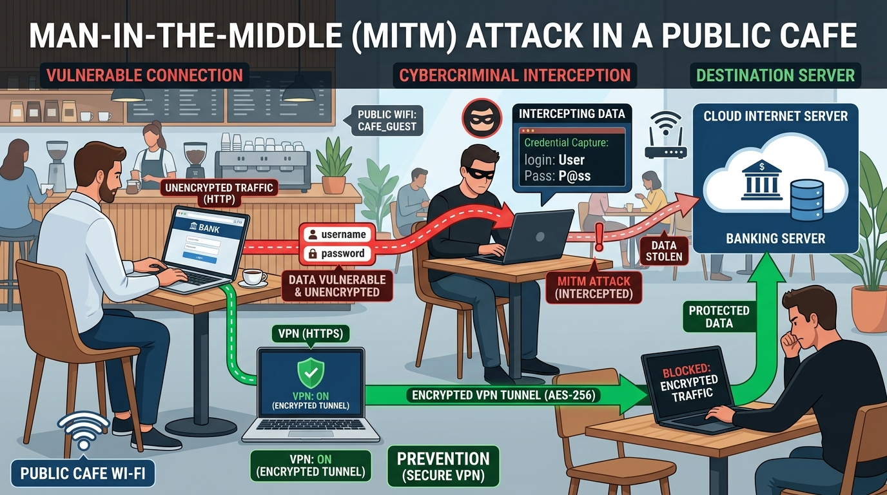
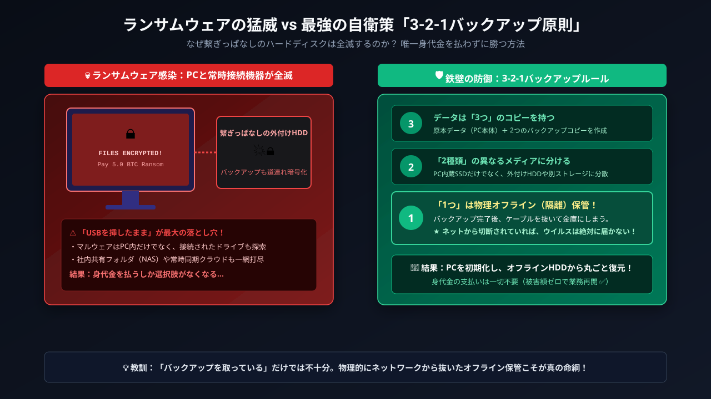

# 情報セキュリティとサイバー脅威

### 本日の講義アジェンダ —— ネット社会の罠とデジタル倫理

#### 🗺️ 本日のアジェンダ（全5テーマ）

1. **Webサイトの見た目に騙されるな —— 画面の裏の罠**（クリックジャッキング・偽Wi-Fi）
2. **あなたを狙う詐欺の心理学 —— 標的型攻撃とマルウェア**（ランサムウェア・感情トリガー）
3. **会社や大学のPCを守る新しい考え方 —— ゼロトラスト**（境界防御の崩壊・EDR）
4. **あなたの行動は筒抜け？ —— スマホとCookieの追跡**（サードパーティCookie・Exif）
5. **身近なサイバー犯罪と法律**（不正アクセス禁止法の3大処罰・悪ふざけの代償）

---

### 本日の到達目標

#### 🎯 本日の講義で身につく力

* サポート詐欺・偽Wi-Fi・悪質プロファイルの罠を見抜き、適切に対処できる
* 巧妙化するSNS乗っ取り・フィッシング・闇バイトの罠を確実に回避できる
* 巨大組織を揺るがすランサムウェアの手口と「踏み台」の恐怖を理解する
* ゼロトラストとEDRの基本思想、3-2-1バックアップを実践できる
* 写真の位置情報（Exif）やCookie追跡の仕組みを知り、プライバシーを守れる
* 不正アクセス禁止法が禁じる行為を正しく把握し、犯罪被害・加害を予防できる

---

### そもそも情報セキュリティとは何か？ —— 「3大要素（CIA）」

#### 🏛️ 世界標準の安全基準：CIAトライアングル

* 単に「パスワードをかけて隠す」ことだけがセキュリティではありません。
* 国際規格（ISO）で定められた**情報セキュリティの3大原則（CIA）**：
  1. **機密性（Confidentiality）**：
     * 許可された人だけが情報にアクセスできる（盗聴・覗き見の防止）。
  2. **完全性（Integrity）**：
     * 情報が改ざんされたり破壊されず、正確である（Web改ざん・データ偽造の防止）。
  3. **可用性（Availability）**：
     * 利用者が必要なときにいつでも安全にアクセスできる（サーバーダウン・DDoS停止の防止）。

::: {.callout-note title="⚖️ 利便性とセキュリティのバランス"}
ガチガチに厳しくしすぎると日常業務が使いにくくなり、緩めすぎると情報が漏洩します。この3要素と使いやすさのバランスをとることがセキュリティの本質です。
:::

---

## 1. Webサイトの見た目に騙されるな —— 画面の裏の罠

### 考えてみたい問い

* 大音量で「ウイルス感染！今すぐ電話を！」と叫ぶ画面の正体は？
* 「非公式MODアプリ」「プロファイル追加」の罠とは？
* カレンダーに勝手に「ウイルス検出！」が入る原因は？

---

### 大音量で叫ぶ！「サポート詐欺」のカラクリ

#### 📢 突然鳴り響く大音量アラーム

* 「ピーピー！あなたのPCはウイルスに感染しました。050-XXXXに今すぐ電話を！」
* 全画面表示になって閉じられないように見せかける。
* **技術的なタネ明かし**
  * **ウイルス感染など1ミリもしていません**。
  * 単にWebブラウザの「全画面表示（F11）」と「音のループ再生」を実行しているだけ！

---

### 【実践・対策】🛡️ 1秒で解決する対処法

::: {.callout-tip title="🛡️ 1秒で解決する対処法"}
電話をかけてはいけません！

* Windows：`Ctrl + W`（タブを閉じる）または `Alt + F4`
* Mac：`command + W`（タブを閉じる）
* スマホ：ブラウザのタブをゴミ箱へ捨てるだけ！
:::

---

### ボタンを押したつもりが別のアクション？（クリックジャッキング）

#### 🪟 透明な罠（Clickjacking）

* 攻撃者は「動画を再生する［PLAY ▶️］」ダミー画面を用意。
* そのすぐ上に、透明度100%にした「退会ボタン」や「送金ボタン」を重ねて配置。
* ユーザーは動画を見ようと押した瞬間、背後の重要操作を実行させられる！

---

### 【たとえ話】📑 契約書の罠でたとえると？

::: {.callout-tip title="📑 契約書の罠でたとえると？"}
**「高額ローンの契約書」**の上に、透明なフィルムを貼った**「可愛い子猫の写真」**を重ねて、「子猫の鼻をタップしてね！」と言ってサインさせる詐欺手口です！
:::

---

### 【構造】クリックジャッキングのレイヤー重なり

```{mermaid}
flowchart TD
    subgraph Layer2 ["表面レイヤー：見えている画面"]
        A["可愛い子猫の写真（動画再生ボタン ▶️）"]
    end
    subgraph Layer1 ["透明レイヤー：透明度100%で重ねられた標的画面"]
        B["送金を実行する / アカウント退会ボタン"]
    end
    A -->|"ユーザーが見かけのボタンをタップ"| B
    style B stroke-dasharray: 5 5,fill:#ffebee
```

* **サーバー側の防御技術**：正規のWebサイトは `X-Frame-Options: DENY`（またはCSPの `frame-ancestors`）を設定し、他サイトによる自画面の透明埋め込みを遮断しています。

---

### 「非公式MODアプリ」と「構成プロファイル」の罠

#### ⚠️ 甘い誘いとiPhone最凶の罠

* **非公式MODアプリの危険**：
  * 「広告全消しアプリ」「ゲームの石が無限になるMOD」など、公式ストアを通さない野良アプリは情報窃盗マルウェアの温床。
* **構成プロファイルの悪用（iPhone最大の危機）**：
  * 「プロファイルをインストール」を許可すると、**全通信が犯人のサーバーへ中継**され、暗号化通信すら解読されて認証情報が丸ごと盗まれます！

---

### カレンダー乗っ取りの手口と消し方

#### 📅 朝から晩まで「ウイルス検出！」の通知

* **仕組み**：怪しいサイトで「カレンダーを照会しますか？」に誤って［OK］を押したのが原因。共有・購読機能を悪用されただけで、スマホ本体は侵入されていません。

::: {.callout-tip title="🛡️ 簡単な消し方"}
iPhone：「設定」→「カレンダー」→「アカウント」→「照会カレンダー」から、不審なカレンダーを選んで**［アカウントを削除］**を押すだけで即座に全消去できます！
:::

---

### URLの見方を身につける（ドメインの解剖学）

#### 🔍 URLの解剖図
`https://` **`login.smbc-card.com`** `.fake-phish.jp` `/app/index.html`

* プロトコル：`https://`
* サブドメイン：`login.smbc-card.com`（攻撃者が本物っぽく名付けただけの文字列！）
* **真のドメイン（FQDN）：** **`.fake-phish.jp`**（スラッシュ `/` の直前にある部分が本当の所有者！）
* パス：`/app/index.html`

---

### 詐欺URLの見極めルールと具体例

#### ❌ 詐欺URLの典型例

* `https://apple.com.secure-auth.net/`
* `https://www-amazon-co-jp.xyz/`

#### 🛡️ 見極めのルール

* **「最初の `/` の直前」にあるドメイン名**に注目する。
* 不安ならリンクを踏まず公式アプリから開く。

---

### 無料Wi-Fiの罠① —— 店舗や空港の「なりすまし（Evil Twin）」

#### 👿 「悪魔の双子（Evil Twin）」とは？

* カフェや空港で、**本物のWi-Fi名（SSID）にそっくり、または同名**の偽ルーターを犯人が設置する手口。
* 例：本物 `Starbucks_WiFi` に対し、偽物 `Starbucks_Free_WiFi`
* **スマホの「自動接続」の盲点**：過去に繋いだSSIDと同じ名前があると、端末が勝手に吸い寄せられて接続してしまう！

---

### 無料Wi-Fiの罠① —— 店舗や空港の「なりすまし（Evil Twin）」（ポイント）

#### 🎣 繋ぐとどうなる？（偽ログイン画面）

* 接続した途端に**偽のログイン画面（Captive Portal）**が表示。
* 「規約同意のためGoogleやLINEでログイン」「セキュリティ向上のためクレカ入力」と騙し、認証情報を丸ごと盗み取る！

---

### 【図解】なりすましWi-Fiによる中間者攻撃（MitM）

```{mermaid}
sequenceDiagram
    autonumber
    participant U as "被害者のスマホ"
    participant F as "偽Wi-Fi (犯人のルーター)"
    participant S as "正規サービス"
    Note over U, F: そっくりなSSIDに自動接続！
    F->>U: 偽のログイン画面を表示 (ID/PASS要求)
    U->>F: 信用してパスワードを入力・送信
    Note over F: 認証情報をまるごと窃取！😈
    F->>S: 盗んだ情報で正規サービスへ不正侵入
```

---

### 公衆Wi-Fiに潜む危険なサインと自衛策

* **スマホの自動接続が仇になる**：
  * 過去に一度繋いだフリーWi-Fiと同名の電波があると、端末は警告なしに接続してしまう。
* **偽の認証画面（キャプティブポータル）の罠**：
  * 「利用規約同意のためSNSでログインしてください」と促し、IDとパスワードを入力させる。

::: {.callout-caution title="⚠️ 危険なサイン"}
公衆Wi-Fiに接続した際、「SNSアカウントでのログイン」や「クレジットカード情報の入力」を求められたら**100%詐欺**です。即座にWi-FiをOFFにしてください。
:::

---

### 【図解】カフェでの中間者攻撃（MitM）とVPN防御

{fig-align="center" width="60%"}

::: {.callout-note title="暗号化のトンネルが命綱"}
暗号化されていない公衆Wi-Fiでは、隣の席の悪意ある人物に通信を盗聴・改ざんされます。HTTPS接続の確認やVPNによるトンネリングが必須の自衛策です。
:::

---

### 無料Wi-Fiの罠② —— 通信の覗き見と外出先の自衛鉄則

#### 👁️ 覗き見のリスクと「HTTPS」の命綱

* 暗号化されていないWi-Fiでは、**同じ電波を受信している人全員に通信内容が筒抜け**になる。
* **命綱は「HTTPS（鍵マーク）」**：アドレスバーに鍵マークがあれば通信は暗号化され、設置者にも解読不能。

#### 🛡️ 外出先での4大ガード術

1. **「Wi-Fi自動接続」をOFF**（見知らぬ偽電波に勝手に吸い寄せられない）。
2. **店内の掲示板で正規のSSIDを確認**。
3. **銀行や決済は「4G/5G回線」で行う**（ギガを少し使うだけで圧倒的に安全！）。
4. **公衆Wi-Fiでは「VPN」を常時オン**にする。

---

### 通信暗号化の究極形 —— 「E2EE（エンドツーエンド暗号化）」

#### 🔒 サービス運営会社ですら「中身を覗けない」技術

* **通常のHTTPS（TLS）暗号化**：
  * あなたのスマホと「企業のサーバー」の間が暗号化される。
  * つまり、**企業の社内やサーバー管理者は、見ようと思えば中身を見られる**（暗号を解く鍵をサーバーが持っているため）。
* **E2EE（End-to-End Encryption）**：
  * 「送信者の端末」で暗号化し、「受信者の端末」だけが鍵を持つ。
  * **中継する通信会社も、LINEやZoomの運営会社自身も、警察や政府ですらメッセージを絶対に盗み見できない！**
* **身近な採用例**：
  * LINEの「Letter Sealing」、WhatsApp、Signal、ZoomのE2EEミーティング。

---

### 📱 実践チェック

#### 🕵️ どっちが本物？クイズ
以下のURLのうち、本物のメルカリ（`mercari.com`）はどれ？

1. `https://www.mercari.com.account-update.info/login`
2. `https://mercari.com/jp/`
3. `https://login-mercari-jp.com/`

---

### 🤔 考えてみよう（振り返り）

#### 🤔 考えてみよう

* 外出先で重要な銀行口座残高を確認したり送金する場合、公衆Wi-Fiとスマホのモバイル回線（4G/5G）のどちらを使うべき？

---

## 2. あなたを狙う詐欺の心理学 —— 標的型攻撃とフィッシング

### 考えてみたい問い

* 友達から「コンテストに投票して」とDMが来たらなぜ危険？
* マッチングアプリで親しくなった相手から投資を勧められたら？
* カバンに知らないAirTagを入れられたらどう教えてくれる？
* 「ウイルス」と「マルウェア」って何が違う？
* 大企業や病院を麻痺させる「ランサムウェア」はどこから侵入する？

---

### SNS乗っ取りの典型手口：友達からの「投票依頼DM」

#### 📩 「私のコンテストの投票に協力して！」

* InstagramやLINEでリアルの友達から突然届く。
* 「投票リンクを押して」「届いた4桁の番号を教えて」。

#### 🔍 裏側で起きていること

* 友達のアカウントは**既にハッカーに乗っ取られている**。
* 教えた番号は**あなたのアカウントのログイン認証コード**！
* 渡した瞬間に自分のアカウントも乗っ取られ、今度は自分が加害者の踏み台にされる。

---

### 【図解】SNS乗っ取り投票DMの悪用シーケンス

```{mermaid}
sequenceDiagram
    autonumber
    participant A as "犯人 (友人を乗っ取り済)"
    participant V as "被害者"
    participant S as "SNS認証システム"
    A->>V: 「投票協力して！届いた番号教えて」
    A->>S: 被害者の電話番号でログイン試行
    S-->>V: SMSで正規認証コード送信
    V->>A: 信用してコードを教えてしまう
    A->>S: 認証コード入力 → 乗っ取り完了！😈
```

---

### マッチングアプリから始まる「投資詐欺（豚の屠殺詐欺）」

#### 🐖 恋愛感情を利用して全財産を奪う手口

1. **信頼構築**：美男・美女からアプローチ。数ヶ月かけて親密な関係を築く（「豚を太らせる」）。
2. **偽取引所へ誘導**：「2人の将来のために」と暗号資産・FXの**偽アプリ**に登録させる。
3. **出金不能**：最初は少額を出金させて信用させ、大金を入金させた途端に出金拒否・音信不通に！

::: {.callout-important title="🚨 絶対の鉄則"}
**「SNSやマッチングアプリで知り合った相手が、投資やお金の話を切り出してきたら100%詐欺」**です。例外は一切ありません！
:::

---

### SNSの「闇バイト」「名義貸し」で人生が詰む仕組み

#### ⚠️ 甘い言葉の誘いと罠

* 「指定の荷物を受け取って運ぶだけ」「口座を作って送るだけで5万円」。
* 「簡単な高収入バイト」の実態は、特殊詐欺の受け子・出し子やマネーロンダリングの道具。
* 応募時に身分証の顔写真を送らされ、辞めようとすると「家族に危害を加える」と脅迫される。

---

### 闇バイトの代償：法的責任と社会的死

#### ⚖️ 知らなかったでは済まない現実

* 口座売買や名義貸しは**犯罪収益移転防止法違反および詐欺罪**。
* 指示役は海外に潜伏し、警察に逮捕されるのは大学生などの末端実行犯。

::: {.callout-danger title="🚨 社会的死：銀行口座が一生作れなくなる"}
一度でも口座凍結されると全銀協ブラックリストに載り、**就職しても給与受取口座すら作れなくなります**。
:::

---

### 【図解】「闇バイト・口座売買」から全口座凍結までの転落フロー

```{mermaid}
flowchart TD
    A[SNSで「即日高収入」に応募] --> B[身分証・顔写真を送信させられ脅迫材料に]
    B --> C[受け子・出し子や口座譲渡を実行]
    C --> D[防犯カメラ等から警察に現行犯逮捕]
    D --> E[💥 全国の銀行口座が永久凍結・ブラックリスト登録]
    style E fill:#ffcdd2,stroke:#d32f2f,stroke-width:2px
```

---

### AirTagなどスマートタグによるストーカー被害

#### 📍 小型紛失防止タグの悪用手口

* 500円玉サイズのAirTagを、カバンの底や車の車体に勝手に忍ばせて自宅を特定する手口。
* Bluetooth電波で周囲のiPhone網を中継し、持ち主の居場所が遠隔でリアルタイム追跡される。
* 見た目では気づきにくく、知らない間にプライベートな居場所が筒抜けになる危険性。

---

### スマートタグ悪用への自衛策：自動警告と検知

#### 🔔 スマホの自動警告機能（AppleとGoogleの共同規格）

* 持ち主の手元を離れたタグが**「あなたと一緒に移動している」**とスマホが判断すると、iPhoneでもAndroidでも**「不審なトラッカーが検出されました」**と自動警告！
* 画面から音を鳴らして物理的に発見し、電池を抜いて即座に無効化できます。

---

### 【図解】スマートタグの悪用とスマホによる自動検知フロー

```{mermaid}
flowchart TD
    A[見知らぬタグがカバン等に忍ばされる] --> B[被害者と一緒に長時間移動]
    B --> C[被害者のスマホが不審なBluetooth信号を検知]
    C --> D[⚠️ 「不審なトラッカーが検出されました」と自動警告]
    D --> E[スマホから音を鳴らして物理発見 → 電池を抜いて停止]
    style D fill:#fff3e0,stroke:#f57c00
    style E fill:#e8f5e9,stroke:#2e7d32
```

---

### 📱 実践チェック

#### 📱 トラッカー検出設定チェック

* iPhone：「設定」→「プライバシーとセキュリティ」→「位置情報サービス」→「システムサービス」のトラッキング通知がオンか確認。
* Android：「設定」→「安全性と緊急情報」→「不明なトラッカーのアラート」を確認。

---

### なぜ賢い人でも詐欺メールに引っかかるのか？

#### ⚡ 巧妙に突かれる「4大感情トリガー」と脳の麻痺

* **突かれる4大感情**：
  * **① 緊急性（焦り）**：「24時間以内に確認」「今すぐ失効」
  * **② 恐怖・不安**：「未納」「アカウント凍結」「不正アクセスの通知」
  * **③ 権威（信用）**：「警察庁」「国税庁」「教務課」「Apple」
  * **④ 利得（期待）**：「給付金の還付」「10万円当選」
* **騙される心理メカニズム（システム1 vs システム2）**：
  * 「焦り・恐怖」を感じた瞬間、論理的思考（システム2）が麻痺し、感情的・反射的本能（システム1）が主導権を奪って偽リンクを押してしまう！

---

### 【図解】詐欺メールが突く4大感情トリガーと心理トラップ

```{mermaid}
flowchart TD
    A["「至急確認」「利用停止」の通知受信"] --> B["⚡ 4大感情トリガー<br/>（緊急性・恐怖・権威・利得）が直撃"]
    B --> C["脳の冷静な思考（システム2）が停止・パニック発生"]
    C --> D["焦りから反射的に偽リンクをタップ！"]
    D --> E["💥 偽画面でパスワード・クレカ番号を入力してしまう"]
    style B fill:#fff3e0,stroke:#f57c00
    style C fill:#ffebee,stroke:#c62828
    style E fill:#ffcdd2,stroke:#d32f2f,stroke-width:2px
```

---

### そもそも「マルウェア」って何？ —— 「ウイルス」との違い

#### 🦠 「マルウェア」＝悪意あるプログラムの総称

* **Mal**icious（悪意ある）＋ Soft**ware**（ソフトウェア）の合成語。
* 世間では何でも「ウイルス」と呼びがちだが、**ウイルスはマルウェアという大家族の「1つの種類」にすぎない！**

::: {.callout-note title="💡 整理：車にたとえると？"}

* **マルウェア** ＝ 「乗り物全般（自動車、トラック、バイク、船…）」
* **ウイルス** ＝ 「セダン（その中の特定の一車種）」
:::

---

### なぜ「ウイルス」と呼ばれるのか？

#### 🔬 生物ウイルスと同じ「自己増殖・寄生」の特徴

* 生物のウイルスは、細胞（宿主）に入り込まないと増殖できない。
* コンピュータウイルスも全く同じで、**「正常なファイルやプログラム（宿主）」に寄生して勝手に自己増殖する**特徴を持つため名付けられた。
* 他の正常ファイルに自分のコードを潜り込ませ、感染を次々と広げていく。

---

### 代表的な5大マルウェア —— それぞれどう違う？

#### 👿 特徴で見分ける悪質プログラム

1. **ウイルス（Virus）**：正常なプログラム（宿主）に**寄生**して自己増殖。
2. **ワーム（Worm）**：宿主不要。ネットワーク経由で**単独で自律増殖・拡散**。
3. **トロイの木馬（Trojan）**：無害な便利アプリや画像の**ふりをして侵入**（自己増殖なし）。
4. **スパイウェア（Spyware）**：キー入力や画面、位置情報を**こっそり盗み見**して外部送信。
5. **ランサムウェア（Ransomware）**：PCやサーバーを勝手に暗号化し、復旧の**「身代金」を要求**！

---

### 【図解】代表的な5大マルウェアの分類ツリー

```{mermaid}
flowchart TD
    M["🚨 マルウェア（悪意あるプログラム全般）"]
    M --> V["🦠 ウイルス<br/>正常ファイルに寄生して増殖"]
    M --> W["🐛 ワーム<br/>単独でネットを通じ自律拡散"]
    M --> T["🐴 トロイの木馬<br/>無害なアプリのふりをして侵入"]
    M --> S["🕵️ スパイウェア<br/>パスワードや画面を密かに盗聴"]
    M --> R["💰 ランサムウェア<br/>データを暗号化し身代金を要求"]
    style M fill:#ffebee,stroke:#c62828,stroke-width:2px
    style R fill:#ffcdd2,stroke:#d32f2f,stroke-width:2px
```

---

### 巨大ビジネスと化した「ランサムウェア」

#### 🏦 なぜ個人ではなく「企業や病院」が狙われるのか？

* **昔と今の違い**：かつての「個人PCの写真を人質に数万円」から、**「組織犯罪マフィアの巨額ビジネス」**へ完全変貌。
* **組織が狙われる理由**：
  * 「1日止まるだけで数億円の損失が出る大企業」や「人命に関わる総合病院」を人質にとることで、**数億〜数十億円の身代金**を脅し取れる。
  * 暗号資産（ビットコイン等）により、足がつかずに世界中から身代金を回収可能に。

---

### 凶悪化する手口「二重恐喝（ダブル・エクストーション）」

#### 😈 逃げ場をなくす2重のワナ

1. **第1の脅迫（業務妨害・身代金）**
   * 社内全サーバーや業務PCのデータを暗号化。
   * 「元に戻したければ復号鍵を金（ビットコイン）で買え」。
2. **第2の脅迫（機密暴露・社会的制裁）**
   * 暗号化の前に、社内の機密情報や顧客・取引先の個人情報を密かに盗み出す。
   * 「バックアップから復旧しても無駄だ。**金を払わないなら盗んだ機密をダークウェブに全世界公開するぞ**」。

---

### 【図解】ランサムウェア二重恐喝（業務停止＋機密暴露）フロー

```{mermaid}
flowchart TD
    A[社内ネットワークへ不正侵入] --> B[機密情報・個人情報を密かに外部流出]
    B --> C[社内全サーバー・業務PCを一斉暗号化]
    C -->|第1の脅迫: 業務妨害| D["💥 業務全面停止<br/>「復旧したければ身代金を払え」"]
    B -->|第2の脅迫: 社会的抹殺| E["💀 機密・個人情報暴露<br/>「払わないなら世界中に無料公開する」"]
    style D fill:#ffebee,stroke:#c62828,stroke-width:2px
    style E fill:#ffebee,stroke:#c62828,stroke-width:2px
```

---

### 【実例】KADOKAWA / ニコニコ動画（2024年6月）

* **ロシア系サイバー犯罪組織「BlackSuit」による大規模攻撃**
* **甚大な被害状況**：
  * ニコニコ動画等の配信サービス全面停止、出版・物流機能の麻痺、経理・社内システム全滅
  * 従業員・取引先・N高生などの**大規模な個人情報流出**（数万件規模）に発展
  * システムの安全な再構築とサービス完全復旧までに**数ヶ月以上**を要した
* **突きつけられた教訓**：
  * 1つの侵入経路から社内ネットワーク全体を掌握され、全インフラが人質に取られた

---

### 【実例】医療崩壊とサプライチェーン停止

#### 🏥 大阪急性期・総合医療センター（2022年10月）

* **給食事業者のVPN装置の脆弱性**から院内ネットワークへ侵入
* **電子カルテシステム全体が暗号化**され、患者データが閲覧不能に
* 手術や緊急救急の受け入れが全面停止し、通常診療再開まで**2ヶ月以上**を要した

::: {.callout-note title="🚗 トヨタの国内全工場停止（2022年3月）"}
部品サプライヤー1社（小島プレス工業）がランサムウェア被害を受けたことで部品供給がストップ。**トヨタの国内全14工場（28ライン）が丸一日操業停止**に追い込まれました。
:::

---

### なぜ新入社員や一般学生が狙われるのか？ —— 「踏み台」の恐怖

#### 🎯 サプライチェーン攻撃の標的は「最も弱い環」

* 攻撃者は、警備が鉄壁な「大企業の中枢サーバー」を正面から突破しようとはしない。
* **狙われるのは「一番油断している周辺の入口」**：
  1. セキュリティ意識がまだ低い**新入社員・インターン生のPC**
  2. セキュリティ投資が追いついていない**子会社・取引先の中小企業**
  3. 病院やオフィスの**給食・清掃・空調などの委託業者**
* 「自分はただの新入りだから狙われない」という油断が、**組織壊滅の最初の足がかり（侵入の踏み台）**にされる！

---

### 【図解】サプライチェーン攻撃における「踏み台」侵入フロー

```{mermaid}
flowchart TD
    A[😈 攻撃者] -->|標的型メール・偽Wi-Fi| B[👤 新入社員・業務委託先のPC]
    B -->|踏み台（中継地点）にして社内探索| C[🏢 本社内部ネットワーク]
    C -->|管理者権限（特権ID）を奪取| D[💾 基幹サーバー・電子カルテ等が一斉暗号化 💥]
    style B fill:#fff3e0,stroke:#f57c00
    style D fill:#ffebee,stroke:#c62828,stroke-width:2px
```

---

### 「盗まれる重要データがないから平気」の致命的な誤解

#### 🧟 あなたのPCがサイバー犯罪の「加害者（ゾンビPC）」にされる

* **学生や個人が陥りがちな油断**：
  * 「私のパソコンには企業の機密データなんて入っていないから、ウイルスに感染しても失うものはない」
* **真の恐怖：ボットネット（Botnet）化**：
  * マルウェアに感染した端末は、遠隔の指令サーバー（C2サーバー）から操られる**「ゾンビPC」**に変貌。
  * あなたが寝ている間に、政府や大企業のサーバーを一斉攻撃してダウンさせる**「DDoS攻撃（分散型サービス妨害）」の凶器**として悪用される！
* **知らない間に自分が犯罪加害者**となり、警察から事情聴取を受けたりプロバイダから回線を強制遮断されるリスクがあります。

---

### 身代金を絶対に払ってはいけない3つの理由

1. **暗号解除の鍵がもらえる保証は一切ない**
   * 相手は犯罪者。金だけ奪って連絡を絶つ、または壊れた鍵を渡されるケースが多発。
2. **「身代金を払うカモ」として世界中にリストが出回る**
   * 一度払うと「脅せば払う組織」と認識され、別の犯罪グループから再攻撃される。
3. **犯罪組織・テロ組織の活動資金になる**
   * 支払った身代金が次のサイバー兵器開発やテロ活動に使われるため、欧米を中心に**法律で支払いを禁止・処罰する動き**が加速。

---

### 唯一の特効薬：最強の「3-2-1バックアップ」原則

ランサムウェアに感染しても「バックアップから丸ごと復元」できれば、身代金を払う必要はない！

* **3つのコピーを保持**
  * 原本データ ＋ 2つのバックアップコピー
* **2つの異なるメディア**
  * PC本体（内蔵SSD）だけでなく、外付けHDDやNASなど異なる媒体に保存
* **1つは遠隔地・オフライン保管**
  * クラウドストレージ、または**ネットワークから物理的に切り離した外付けドライブ**（繋ぎっぱなしだとバックアップごと暗号化されるため！）

::: {.callout-tip title="学生生活でも命綱になる！"}
卒論・研究データ・制作物・写真など、「消えたら人生が終わる」データは今すぐ3-2-1バックアップを実践しましょう。
:::

---

### 【図解】ランサムウェア感染 vs 3-2-1バックアップ復旧

{fig-align="center" width="65%"}

::: {.callout-note title="バックアップを「抜いておく（エアギャップ）」重要性"}
PCに外付けHDDを繋ぎっぱなしにしているとバックアップごと暗号化されます。「物理的にケーブルを抜いて保管」することで、感染しても1円も払わずに100%復旧可能です。
:::

---

### 🤔 考えてみよう（振り返り）

#### 🤔 ケーススタディ

* 友達からのSNS投票依頼DMや、大学・会社を騙る「緊急セキュリティ確認」メールが届いた時、反射的にクリックする前に立ち止まって確認すべきアクションは何？

---

## 3. 会社や大学のPCを守る新しい考え方 —— ゼロトラスト

### 考えてみたい問い

* Zoomで画面共有している時、LINEの通知が全員に見えてしまう事故を防ぐには？
* なぜ「社内LANに繋いでいれば安全」という神話は崩壊した？
* 会社や大学のPCに入っている「EDR」は何を見張っている？

---

### 画面共有通知バレの事故と防ぐ3大鉄則

#### 😱 全員に見られてしまったプライベート通知

* ZoomやTeamsで画面共有中、右上にLINE等の「飲み会どうする？」「教授マジ無理」という通知がポップアップして全員に公開される事故が多発！

::: {.callout-tip title="🛡️ 画面共有の3大鉄則"}
1. **「ウィンドウ指定共有」を使う**：デスクトップ全体ではなくスライドのアプリだけを共有。
2. **「集中モード（通知オフ）」の活用**：画面共有中は通知バナーを自動非表示にする。
3. **通知プレビューの非表示**：万一通知が出ても、送信者やメッセージ本文を隠す設定にしておく。
:::

---

### お城の堀は埋まった —— 境界型防御の崩壊

#### 🏰 「社内ネット＝安全」という神話が崩れた理由

* **かつての「境界型防御」**：社内LANにファイアウォール（城壁）を築き、内側を無条件に信用する設計。
* **崩壊した2大破綻要因**：
  1. **境界の消失（クラウドとテレワーク）**：社員が自宅やスマホから直接クラウドを使い、城壁の外側で業務が完結。
  2. **侵入後のフリーパス（ラテラルムーブメント）**：一度VPN等を突破されると、城内はノーガードでやりたい放題に感染拡大！

---

### 【図解】かつての「境界型防御」とお城の崩壊

```{mermaid}
flowchart LR
    subgraph Outside["🌐 危険な城外（インターネット）"]
        Attacker["😈 攻撃者"]
    end
    subgraph Perimeter["🛡️ 城壁（境界）"]
        FW["ファイアウォール / VPN"]
    end
    subgraph Inside["🏰 安全と過信された城内（社内ネットワーク）"]
        PC["PC・端末"]
        DB["機密ファイルサーバー"]
        PC <--> DB
    end
    Attacker -->|VPNの脆弱性や認証情報窃盗で突破| Perimeter
    Perimeter -->|一度内部に入り込まれると| Inside
    style Inside fill:#ffebee,stroke:#c62828
    style Perimeter fill:#fff3e0,stroke:#f57c00
```

---

### ゼロトラスト＝「誰も信じない、毎回確認する」

#### 🛡️ Never Trust, Always Verify（決して信頼せず、常に検証せよ）

* 社内ネットワークや役員の端末であっても無条件に信用せず、**「アクセスごとに毎回すべての正当性を検証」**する新しいセキュリティ思想。
* 「正しいユーザーか？」「端末にウイルスがいないか？」「不審な場所からのアクセスではないか？」を常時判定。

::: {.callout-tip title="✈️ 空港の搭乗ゲートでたとえると？"}
* **境界型（昔）**：空港の入口で1回確認したら、あとはどの飛行機にも乗り放題（ガバガバ）。
* **ゼロトラスト**：搭乗口、座席、操縦室のドアを開けるたびに、**毎回パスポートと指紋を再照合する仕組み**です！
:::

---

### 【図解】ゼロトラスト判定エンジンの常時検証
```{mermaid}
flowchart LR
    A["社外・社内端末"] --> B{"ゼロトラスト<br/>判定エンジン"}
    B -->|ユーザー確認<br/>端末健全性チェック<br/>振る舞い分析| C["社内クラウド<br/>各リソース"]
    style B fill:#e8f5e9,stroke:#2e7d32
```

::: {.callout-note}
ゼロトラストは従業員を疑っているのではなく、「PCが乗っ取られた場合に被害を最小限に食い止めるシートベルト」です。
:::

---

### EDR（Endpoint Detection and Response）とは？

#### 🚗 パソコンの「ドライブレコーダー 兼 緊急ブレーキ」

* **正式名称**：Endpoint Detection and Response（端末での検知と対応）。
* **従来のウイルス対策ソフト（EPP）の限界**：
  * 「侵入を水際で100%防ぐ」前提。しかし新種マルウェアや標的型攻撃はすり抜けてしまう。
* **EDRの基本思想 ——「侵入されることを前提にする」**：
  * PC内の全プロセスの起動・ファイル変更・通信ログを**24時間常時記録**。
  * ランサムウェアの暗号化など「怪しい振る舞い」を検知した瞬間、**自動でネットワークからPCを隔離**して被害拡大を阻止！
  * 事故後に「どのメールから侵入されたか」をドライブレコーダーのように巻き戻して調査可能。

---

### 【比較一覧】従来のウイルス対策ソフト（EPP）vs 最新のEDR

| 項目 | 従来のウイルス対策（EPP） | 最新のEDR |
|:---|:---|:---|
| **基本思想** | 侵入を「水際で防ぐ」（予防） | 侵入を前提に「即検知・隔離」（事後対応） |
| **判定基準** | 既知のパターンファイル（指名手配写真） | プロセスや通信の「不審な挙動（振る舞い）」 |
| **未知の脅威** | パターン更新まで無力（すり抜ける） | 未知の攻撃でも異常挙動で即座に遮断 |
| **事後調査** | ログが残らず原因追究が困難 | ドライブレコーダーのように侵入経路を完全再現 |

---

### 利用者が守るべき基本動作 —— 端末防衛とシャドーITの禁止

#### 🛡️ 個人と組織を守る3大防衛ルール

1. **OS・アプリの即時アップデート**：脆弱性を放置せず、自動更新をオンにして「壊れた鍵穴」を塞ぐ。
2. **私用USBメモリを挿さない**：落ちているUSBや私物はマルウェア感染・情報漏洩の最大要因！
3. **「シャドーIT」の絶対禁止**：会社の許可なく私用LINEや個人Googleドライブに業務ファイルを転送しない（個人アカウント漏洩＝会社全体の機密漏洩）。

---

### 日本企業の悪習「PPAP（パスワード付きZipの別送）」の罠

#### ✉️ 1通目に暗号化Zip、2通目にパスワードを送る茶番

* かつて日本の官公庁や大企業で大流行したビジネスマナー**「PPAP」**：
  * **P**：Password付きZip暗号化ファイルを送る
  * **P**：Passwordを別便のメールで送る
  * **A**：暗号化（An-goka）
  * **P**：Protocol（プロトコル）
* **なぜ無意味で危険なのか？**：
  1. **盗聴耐性ゼロ**：メール通信やメールボックスが盗聴されていたら、1通目も2通目も同じ犯人に盗まれる！
  2. **ウイルスの温床**：Zip暗号化されると、企業のセキュリティゲートウェイがウイルススキャンできずにすり抜けてしまう。
* **政府が全廃宣言**：2020年にデジタル改革会議で**政府機関でのPPAP全廃**が決定。クラウド共有リンク（GoogleドライブやBox）へ完全移行しました。

---

### 📱 実践チェック

#### 💻 端末チェック

* 自分のPCやスマホのOSバージョンを確認。
* 画面共有時の「通知オフ設定（集中モード）」を確認しよう。

---

### 🤔 考えてみよう（振り返り）

#### 🤔 ケーススタディ

* 「課題提出期限まであと10分。研究室PCから自分のスマホにデータを移したいがメールが使えない。手元の私用USBを使うべきか？」

---

## 4. あなたの行動は筒抜け？ —— スマホとCookieの追跡

### 考えてみたい問い

* シークレットモードを使えば学校や会社にも完全匿名で行動できる？
* 自宅で撮った写真をSNSに投稿すると、なぜ家が特定される？
* さっき検索した靴の広告が別サイトに出てくるのはなぜ？

---

### ブラウザの「シークレットモード」の大誤解と真実

#### ❌ よくある大誤解 vs ⭕ 技術的な真実

* **❌ 大誤解**：「シークレットモードなら学校Wi-Fiや警察、Googleにも完全にバレない無敵の匿名モード」
* **⭕ 隠せるもの（手元の端末内のみ）**：
  * ブラウザの閲覧履歴・検索履歴、一時的なCookieや入力フォーム。
* **❌ 隠せないもの（外部からは丸見え）**：
  * 学校や会社のネットワーク管理者、プロバイダの通信ログ、アクセス先サーバー。

---

### 【たとえ話】👣 部屋の足跡でたとえると？

::: {.callout-tip title="👣 部屋の足跡でたとえると？"}
シークレットモードは、出かける時に**「自分の部屋の中の足跡をモップで掃除してから出る」**ようなものです。外の道路を歩いている姿は、**街中の防犯カメラ（学校Wi-Fiやアクセス先）にバッチリ映っています！**
:::

---

### 写真の位置情報（Exif）と特定班の罠

#### 📍 写真データに刻まれるGPS座標と背景の特定リスク

* **Exifデータ**：スマホ写真には「正確な緯度・経度」「撮影日時」が埋め込まれている。
* **特定班の手口**：電柱の地名、マンホール、建物の配置、窓の外の景色、瞳の反射から自宅や最寄り駅が割り出される。
* SNS投稿時は多くのアプリで自動消去されるが、**メール添付、AirDrop、個人ブログ、フリマ出品では残ったまま相手に渡る危険大！**

---

### 写真投稿の自衛鉄則 —— 自宅バレを完全防御する

#### 🛡️ 日常で守るべき3大ルール

1. **カメラの位置情報をオフ**：自宅周辺で撮る写真は、カメラの位置情報権限をオフにする。
2. **タイムラグ投稿**：「今ここにいる」ではなく、帰宅後や数日経ってから投稿する。
3. **背景の徹底確認**：最寄り駅の看板、路線図、学校の制服、カレンダーの予定が写り込んでいないか必ず拡大チェック！

---

### そもそも「Cookie（クッキー）」って何？ —— ネットの預かり証

#### 🍪 ブラウザに預ける小さなテキストメモ帳

* Webサイトを訪問したとき、サーバーがあなたのブラウザ（スマホやPC）にそっと渡す**「状態記憶メモ」**。
* **本来の3大必須役割（これがないとネットは超不便！）**：
  * **ログイン状態の維持**：ページ移動ごとに毎回ID/PASSを打ち直さずに済む。
  * **ショッピングカートの保持**：別ページを見てもカートの中身が消えない。
  * **個人設定の記憶**：ダークモードや言語設定を次回訪問時もキープ。
* 結論：Cookie自体は悪者ではなく、現代Webの利便性を支える必須技術です。

---

### ファーストパーティCookie vs サードパーティCookie

#### 🟢 今見ているサイト（安全） vs 🔴 外部広告会社（追跡）

* **🟢 ファーストパーティCookie（安全・必須）**：
  * **今直接アクセスしているサイト自身**（例: amazon.co.jp）が発行。ログインやカート用で無害。
* **🔴 サードパーティCookie（追跡とプライバシー侵害の温床）**：
  * サイト内に埋め込まれた**「外部の広告会社や分析ツール」**が発行。
  * 異なるWebサイトをまたいで**「いつ・どんなサイトを見たか（行動履歴）」を裏で監視・追跡（トラッキング）**し、個人の嗜好データを勝手にプロファイリングする！

---

### さっき見たスニーカーが追いかけてくる怪談 —— リターゲティング広告

#### 👟 サイトをまたぐ追跡のからくり

* 靴の通販サイトAを見た後、無関係なニュースサイトBを開くと、さっき迷っていたスニーカーの広告がピタリと表示される。
* 「スマホに盗聴されている？」と怖がる人が多いが、真犯人は**「サードパーティCookie」**。
* サイトAとサイトBの双方が同じ広告会社と提携しており、Cookieの端末IDをもとに**「この端末は靴Aに興味あり」と紐付けて別サイトでも追いかけてくる**仕組みです。

---

### 【図解】サードパーティCookieによるリターゲティング追跡シーケンス

```{mermaid}
sequenceDiagram
    autonumber
    participant U as "ユーザーのブラウザ"
    participant A as "靴の通販サイトA"
    participant AD as "広告配信会社"
    participant B as "ニュースサイトB"
    U->>A: 靴の商品ページを閲覧
    A-->>U: Webページを表示
    AD-->>U: 広告会社がブラウザに「追跡用Cookie」を付与
    Note over U, AD: 「この端末は靴Aに興味がある」と記憶！
    U->>B: 全く無関係なニュースサイトBを閲覧
    B->>AD: 枠内に広告をリクエスト
    AD->>B: Cookieを照合し「さっきの靴」の広告を表示！👟
```

---

### Cookie同意バナーの選び方 —— 「すべて同意」を押さない

#### 🍪 「すべて同意」を押さない

* Cookie同意バナー（CMP）では、**「必要最低限のみ許可（Reject All）」**を選ぶのがプライバシー防衛の基本。
* iOSの「Appにトラッキングしないよう要求」を活用。

---

### 📍 スマホの位置情報・写真アクセス権限の絞り込み

#### 📍 位置情報・写真権限の絞り込み

* なぜ電卓アプリが位置情報を求める？
* 位置情報は「常に許可」ではなく**「使用中のみ」**。
* 写真も「すべての写真」ではなく**「選択した写真のみ」**に絞り込む！

---

### 差分プライバシー —— 全体は見せるが個人は隠す

#### 🪙 数学の知恵：差分プライバシー

* ユーザーの生データに「制御された数学的ノイズ」をわざと混ぜて送信。
* 個人のデータは復元不能だが、**数百万人のデータを集めて平均化するとノイズが相殺され**、正確な統計だけが浮かび上がる！

---

### 【たとえ話】🪙 コイン投げアンケートでたとえると？

::: {.callout-tip title="🪙 コイン投げアンケートでたとえると？"}
「カンニングしたことある？」と聞く時、コインが表なら正直に答え、裏なら無条件で「はい」と答える。  
$	o$ 誰がカンニングしたかは隠せるのに、**全体の本当の割合は数学的に計算できる**のと同じです！
:::

---

### 【図解】ノイズ付加によるプライバシー保護
```{mermaid}
flowchart TD
    A[ユーザーの生データ] --> B[数学的ノイズを添加]
    B -->|個人特定不能なデータ| C[サーバーで集計]
    C -->|数百万件集約でノイズ相殺| D[正確な統計・AI学習完了 ✅]
    style B fill:#e1f5fe,stroke:#0288d1
```

::: {.callout-note}
AppleやGoogleはこの技術を使い、利用者のプライバシーを侵害することなくキーボードの予測変換などを賢くしています。
:::

---

### 📱 実践チェック

#### 📱 写真のExif確認ワーク

* スマホの写真アプリで過去の写真を開き、上にスワイプ（または「詳細情報」）。
* 撮影した地図上の正確なピン位置が表示されるか確認しよう。

---

### 🤔 考えてみよう（振り返り）

#### 🤔 考えてみよう

* 「無料のWebサービスを使っている時、商品はお金ではなく『あなた自身の個人データ』である」とはどういう意味？

---

## 5. 身近なサイバー犯罪と法律 —— 不正アクセス禁止法

### 考えてみたい問い

* 友達のスマホのパスコードを勝手に解除して中身を見るのは犯罪？
* 元恋人のSNSアカウントに勝手にログインしたらどうなる？
* パスワードを他人に教えるだけで処罰される法律がある？

---

### 友達のスマホを勝手に覗いたら犯罪？（不正アクセス禁止法）

#### ⚖️ 「悪ふざけ」では済まされない法律の壁

* 友人のスマホのパスコードを勝手に解除して中身を見る。
* 元恋人のSNSパスワードでログインしてDMを覗く。
* **不正アクセス禁止法違反（不正アクセス行為の禁止等に関する法律）であり、れっきとした刑事罰（犯罪）**です！
* 「パスワードを知っていたから」といって、**利用権限のない他人が勝手にログインすること自体が明確な違法行為**になります。

---

### 【比較一覧】不正アクセス禁止法で処罰される3大行為

| 行為 | 法律上の罪名 | 法定刑 | 具体例 |
|:---|:---|:---|:---|
| **勝手にログイン** | 不正アクセス行為（第3条） | 3年以下の懲役 / 100万円以下の罰金 | 他人のID/PASSで無断ログイン、他人の端末を勝手に操作 |
| **他人に教える** | 不正アクセスの助長（第5条） | 1年以下の懲役 / 50万円以下の罰金 | 入手した友人のパスワードを他人に教える、掲示板に晒す |
| **パスワードを不正取得** | 不正取得行為（第4条） | 1年以下の懲役 / 50万円以下の罰金 | フィッシングサイトで盗む、覗き見（ショルダーハック） |

---

### 不正アクセスとサイバー犯罪の総まとめ

#### 🛡️ システムと通信の安全を守るための5原則

1. **画面の見た目を疑う**：偽Wi-Fi、クリックジャッキング、偽警告に騙されず、正規URLを確認する。
2. **人の心の隙を塞ぐ**：フィッシングや闇バイトの甘い誘いを退け、標的型メールの添付を開かない。
3. **境界防御を過信しない**：ゼロトラストの思想を持ち、EDRや3-2-1バックアップで万一に備える。
4. **追跡とプライバシーの自衛**：サードパーティCookieの拒否、Exif位置情報の削除を習慣づける。
5. **法と倫理を守る**：他人のアカウントへの無断ログインは重大な犯罪（不正アクセス禁止法）と自覚する。

::: {.callout-tip title="🎓 脅威を知ることが最強の盾になる"}
サイバー攻撃は遠い世界の事件ではなく、あなたのアカウントやPCを「踏み台」にして広がります。正しい知識と防犯の基本動作を身につけ、安全なデジタルライフを送りましょう！
:::

---

### 🤔 考えてみよう（情報セキュリティとサイバー脅威の振り返り）

#### 💡 日常生活のセルフチェック

* 友達からSNSで「電話番号貸して」「このリンク踏んで」と言われたら、本人に別の手段（通話や対面）で確認できますか？
* 会社や大学のPCで、不審なUSBメモリを挿したり私用クラウドにファイルを送ったり（シャドーIT）していませんか？
* ランサムウェアやデータ消失に備えて、「3-2-1バックアップ」の実践を意識できていますか？


