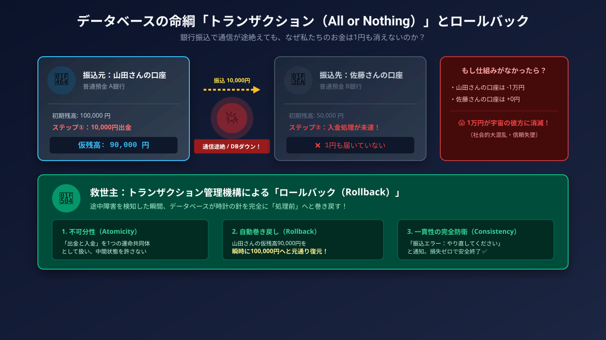

# 第3部：データベースと通信の裏側

### 本日の講義マップ —— アジェンダ

1. **データベースって何？ —— 巨大なエクセルとの違い**
2. **ダブルブッキングはなぜ起きない？ —— トランザクション**
3. **アプリとクラウドはどう会話しているのか？**

---

### 本日の到達目標 —— データの裏側を理解する

* キャッシュの役割とデータベース（RDB）の強みを理解する
* トランザクション（ACID）とデータ整合性の重要性を説明できる
* APIとJSONによるデータ送受信の仕組みを把握する
* 通信速度・Ping値と動画圧縮・ギガ消費の正体を解き明かす


---

---

## 1. データベースって何？ —— 巨大なエクセルとの違い

### 考えてみたい問い

* 写真や動画を消したのに「容量がいっぱいです」と出るのはなぜ？
* 「クラウドの写真を消したら本体からも消えた！？」なぜ？
* なぜ企業の基幹システムはExcelではなくデータベース（RDB）を使う？

---

### そもそも「データベース」って何？ —— 電子の整理棚

#### 🗄️ コンピュータのための超高機能な「整理金庫」

* スマホの「メモ帳」やPCの「Excel」は、人間が手で読んだり編集したりするための文書。
* **データベース（Database / DB）**は、コンピュータが**「膨大な量のデータを、超高速・正確・同時に検索・整理・共有するため」**に極限まで最適化された専用システム！
* 数億件のデータの中から、指定の1行をわずか**0.001秒（1ミリ秒）**で見つけ出すことができます。

---

### 私たちの日常はデータベースだらけ！

私たちが普段使っているすべてのアプリの裏側で、巨大なデータベースが稼働しています。

* **🛒 Amazon / 楽天**：
  * 数億点に及ぶ商品の在庫数・価格・写真・レビュー・注文履歴
* **💬 LINE / Instagram**：
  * 友達リスト・メッセージ履歴・投稿写真・いいねの数
* **🏦 ネット銀行・PayPay**：
  * あなたの預金残高・送金履歴・ポイント数
* **🎮 オンラインゲーム**：
  * キャラクターのレベル・所持アイテム・ガチャの排出管理

::: {.callout-note title="もしデータベースがなかったら？"}
Excelファイルに100万人から同時に書き込みが殺到し、ファイルが即座にクラッシュして世界中のサービスが停止します！
:::

---

### スマホ容量を食い潰す「その他・キャッシュ」の正体

#### 🗑️ キャッシュ（Cache）とは？

* 一度開いた画像やWebページを「次回素早く表示するため」に端末内に一時保存したデータ。
* **最大の犯人**：LINEのトークルーム画像、Instagram/TikTokの視聴履歴、SafariのWebキャッシュ。

---

### 【たとえ話】📚 机の上の本でたとえると？

::: {.callout-tip title="📚 机の上の本でたとえると？"}
よく使う教科書を、毎回遠くの本棚（ネット）まで取りに行くのが面倒だから、**「机の上に一時的に出しっぱなしにしておく」**のがキャッシュです。机の上が本で埋まったら（容量不足）、一度机を片付ける（キャッシュ削除）必要があります！
:::

---

### 【実践】LINEのキャッシュを消して容量を空ける手順

#### 📱 LINEのキャッシュ削除手順

1. LINEの「設定（歯車）」を開く
2. 「トーク」を選択
3. 「データの削除」をタップ
4. **「キャッシュ」のみにチェックを入れて削除！**

---

### 【実践】LINEのキャッシュを安全に削除する手順

::: {.callout-tip title="✨ これで安心"}
写真やテキストメッセージ自体は消えずに、一時保存データだけが消えるため、安全に数GB〜十数GBの空き容量が復活します！
:::

---

### 「同期」と「バックアップ」の致命的な勘違い① —— 同期の落とし穴

#### 🔄 同期（Sync: iCloud / Googleフォトの標準動作）

* **「手元とクラウドを常にまったく同じ状態に保つ」仕組み（双方向連動）**
* 手元のスマホとクラウドサーバーが「鏡」のように常に一致するように動きます。

::: {.callout-danger title="⚠️ よくある大悲劇：写真の全滅！"}
スマホのストレージ容量を空けようとして端末の写真アプリから写真を削除すると、**「鏡」であるクラウド側の写真も連動して即座に完全消去**されます！  
「クラウドにあるから本体を消しても大丈夫」という思い込みが一番危険です。
:::

---

### 「同期」と「バックアップ」の致命的な勘違い② —— バックアップの安心

#### 📦 バックアップ（Backup: 一方向の独立退避）

* **「ある時点のデータの完全な複製を、独立した別金庫に保存する」仕組み**
* 手元の端末から切り離された別の場所（外付けHDDや独立ストレージ）に保管します。

::: {.callout-tip title="🛡️ スマホを消しても絶対に消えない！"}
スマホ本体の写真を削除しても、別金庫にあるバックアップデータには何の影響もありません。  
**「残すための保存（バックアップ）」**と**「揃えるための連動（同期）」**は根本的に全く別の技術です！
:::

---

### 【図解】「同期（双方向）」と「バックアップ（一方向保存）」の違い

```{mermaid}
flowchart LR
    subgraph Sync["🔄 同期（双方向連動: 鏡の関係）"]
        A["📱 スマホ本体"] <-->|削除も変更も即座に連動| B["☁️ クラウドストレージ"]
    end
    subgraph Backup["📦 バックアップ（一方向退避: 金庫の関係）"]
        C["📱 スマホ本体"] -->|定期的に複製を退避保管| D[("🗄️ 独立した別金庫")]
    end
    style Sync fill:#fff3e0,stroke:#f57c00
    style Backup fill:#e8f5e9,stroke:#2e7d32
```

---

### エクセルで顧客管理をしてはいけない理由（Excelの限界）

#### 📊 Excelの限界

* **同時編集の競合**：複数人で同時保存すると上書き事故が起きる。
* **データ量の限界**：数十万行で激重・フリーズ。
* **権限管理の粗さ**：列ごとの細かな閲覧制御が困難。

---

### データベース（RDB）の強み —— 大量データと同時編集

#### 🗄️ データベース（RDB）の強み

* **同時アクセスの保証**：何万人もの同時注文でも矛盾なく安全に更新。
* **巨大データの処理**：数億件でもミリ秒単位で検索。
* **厳格なセキュリティ**：列単位・行単位での権限設定が可能。

---

### データの重複が招く事故（非正規化の罠）

#### ❌ 悪い設計（非正規化）
1つの表に「注文・商品・顧客・住所」を全部手書き。引っ越した時に過去の何百行もの住所を手作業で直す必要があり不整合が発生！

---

### 良い設計 —— データを綺麗に分ける「正規化」

#### ⭕ 良い設計（正規化されたRDB）
用途ごとに表を分割し、**「ID番号」**だけで結びつける（JOIN）。プロフィールの住所を1箇所直すだけで全注文が連動！

---

### 【イメージ】共通のキー（鍵）で表を結びつける「JOIN」

{fig-align="center" width="60%"}

::: {.callout-note title="🔑 主キーと外部キーで表を結合"}
「生徒名簿」と「試験結果」を別々の表で管理し、共通のキー（Student ID）を鍵のように差し込んで結合（JOIN）することで、データの重複を防ぎながら自由自在に情報を引き出せます。
:::

---

### 【図解】テーブル分割と外部キー連携
```{mermaid}
erDiagram
    CUSTOMER ||--o{ ORDER : places
    PRODUCT ||--o{ ORDER : contains
    CUSTOMER {
        int customer_id PK
        string name
        string address
    }
    ORDER {
        int order_id PK
        int customer_id FK
        int product_id FK
        date order_date
    }
    PRODUCT {
        int product_id PK
        string product_name
        int price
    }
```

---

### 1億件の中から一瞬で検索できる理由（インデックス）

#### 🐌 全表走査（Full Table Scan）

* 1億件のデータを、1行目から順に1件ずつ探していく方法。
* 件数が増えるほど時間が激増し、数秒〜数分待たされる（$O(N)$）。

#### ⚡ インデックス（B+ツリー索引）

* あらかじめ五十音順やID順に整理して作られた「目次・辞書」。
* データを2分・多分割しながら絞り込むため、**1億件あってもわずか20数回の比較（$O(\log N)$）**で目的の行へミリ秒で直行！

---

### 【図解】B+ツリーインデックスによる超高速検索木

```{mermaid}
graph TD
    Root["📚 目次（ルートノード）"] --> Left["A 〜 M のグループ"]
    Root --> Right["N 〜 Z のグループ"]
    Right --> R1["N 〜 S のグループ"]
    Right --> R2["T 〜 Z のグループ"]
    R1 --> Data["🎯 「S: 佐藤さん」のデータへ直行！<br/>（1億件でもわずか3〜4手で到達）"]
    style Root fill:#e1f5fe,stroke:#0288d1
    style Data fill:#e8f5e9,stroke:#2e7d32,stroke-width:2px
```

---

### 📱 実践チェック

#### 🗂️ ストレージ棚卸し

* iPhone：「設定」→「一般」→「iPhoneストレージ」
* Android：「設定」→「ストレージ」
* **LINEやブラウザのキャッシュが何GB食っているか確認しよう！**

---

### 🤔 考えてみよう（振り返り）

#### 🤔 考えてみよう

* 「同期」と「バックアップ」を取り違えて写真や連絡先を全消去してしまった場合、復元することは可能？

---

## 2. ダブルブッキングはなぜ起きない？ —— トランザクション

### 考えてみたい問い

* ガチャ確率1%を100回引いて当たらないのは詐欺なのか？
* 送金の途中でスマホの充電が切れたら、1万円は消滅する？
* 新幹線の最後の1席を2人が同時にタップしたらどうなる？

---

### ソシャゲのガチャ確率表示と「天井」の数学

#### 🎰 1%を100連引いても当たらない？

* ガチャは引くたびに確率がリセットされる「独立試行」。
* **数学の冷酷な真実**
  * 1回外れる確率：$0.99$（99%）
  * 100連引いて「すべて外れる」確率：
    $$(0.99)^{100} \approx 0.366 \quad (36.6\%)$$

  * つまり、**「約3人に1人以上」は1回も当たらず大爆死する**のが純粋な数学的必然！

::: {.callout-tip title="🎰 天井（救済措置）の導入背景"}
「確率詐欺だ」という課金トラブルが多発したため、業界ガイドラインにより「300連で目当てのキャラと確実に交換」できる天井システムが法制化・普及しました。
:::

---

### 【図解】ガチャ確率1%を100連引いた結果の内訳

```{mermaid}
pie title 1%のガチャを100連引いた時の確率分布（%）
    "1回以上当たる人（約3人に2人）" : 63.4
    "100回連続ですべて外れる人（約3人に1人）" : 36.6
```

---

### 送金の途中でシステムが落ちたらどうなる？

#### 💸 銀行送金における2つの不可分なステップ

1. **処理①**：Aさんの口座残高から1万円を**引き落とす**（3万円 → 2万円）
2. **処理②**：Bさんの口座残高へ1万円を**加算する**（1万円 → 2万円）

#### 💥 もし処理①の直後に停電や回線切断が起きたら？

* 制御の仕組みがない場合、Aさんの口座から1万円が消滅したのにBさんには届かない。
* **「電子マネーや現金が宇宙空間に蒸発して消滅する」**という大惨事になる！

---

### 【図解】送金中のシステムクラッシュとデータ蒸発危機

```{mermaid}
sequenceDiagram
    autonumber
    participant A as "Aさんの口座 (残高3万円)"
    participant S as "銀行送金システム"
    participant B as "Bさんの口座 (残高1万円)"
    S->>A: 残高から1万円を引く (新残高: 2万円)
    Note over S: 💥 ここでサーバー電源喪失・クラッシュ！
    Note over S, B: 残高加算が行われない！<br/>(1万円が世界から蒸発する危機)
```

---

### All or Nothing —— トランザクションとACID

* **トランザクション**：複数の処理を不可分の「1つの塊」として扱う約束事。
* **コミット**：全成功なら確定。
* **ロールバック**：1つでも失敗したら**処理前の状態に時計の針を完全に巻き戻す**！

---

### 【たとえ話】🥤 自動販売機でたとえると？

::: {.callout-tip title="🥤 自動販売機でたとえると？"}
自販機にお金を入れてボタンを押した時、ジュースが詰まって出てこなかったら、**入れたお金がそのままチャリンと返却口に戻ってくる**仕組みです。中途半端にお金だけ取られることは絶対にありません！
:::

---

### 【図解】コミットとロールバックの流れ

```{mermaid}
flowchart TD
    Start[トランザクション開始] --> Step1[処理①: A口座から引く]
    Step1 --> Step2{処理②: B口座へ足す}
    Step2 -->|成功| Commit[✅ コミット: 処理確定]
    Step2 -->|失敗 / クラッシュ| Rollback[🔄 ロールバック: 処理前に戻す]
    style Rollback fill:#ffcdd2,stroke:#d32f2f
```

* **ACID特性のAtomicity（不可分性）**：「すべて成功するか、すべて取り消すか（All or Nothing）」をシステムが厳格に保証します。

---

### 【イラスト】トランザクション（All or Nothing）とロールバック

{fig-align="center" width="65%"}

::: {.callout-note title="お金が絶対に消えない数学的・工学的保証"}
A口座から出金された後、通信エラーや停電が起きても、トランザクション機能が処理前の状態に自動復元（Rollback）するため、中途半端なデータ不整合は絶対に生じません。
:::

---

### 新幹線の最後の1席を同時に予約したら？（排他制御）

#### 🚄 0.001秒を争うタッチ差の世界

* 残り「1席」の新幹線チケットを、AさんとBさんが完全に同時に購入タップ！
* 何の仕組みもなければ両方に「予約完了」が出てしまい、車内で同じ席を取り合う**ダブルブッキング**が起きる。

#### 🔒 排他制御（行ロック機構）による解決

* 0.001秒でもサーバーに通信が早く届いたAさんの処理が、その座席データに**見えない鍵（行ロック）**をかける。
* ロック中、Bさんのリクエストは待機させられ、Aさんの支払いが確定した瞬間に「申し訳ありません、満席です」と正しく安全に弾かれる！

---

### 【図解】行ロック（排他制御）によるダブルブッキング防止シーケンス

```{mermaid}
sequenceDiagram
    autonumber
    participant A as "ユーザーA (0.001秒先)"
    participant S as "予約DBサーバー"
    participant B as "ユーザーB (タッチ差)"
    A->>S: 最後の1席の予約を要求
    Note over S: 🔒 対象座席データに行ロックをかける！
    B->>S: 同じ座席の予約を要求
    Note over S: ⚠️ ロック中のためBの処理を待機 / 拒絶
    S-->>A: 座席確保・予約完了通知 ✅
    Note over S: 🔓 ロック解除（残席0確定）
    S-->>B: 「満席のため予約できませんでした」❌
```

---

### 銀行システムと強整合性 —— 1ミリのズレも許さない世界

#### 🏦 銀行システム（強整合性）

* 1円のズレも許されない。
* 世界中で常に完全一致を保証（処理時間はかかる）。

---

### SNSの「いいね」と結果整合性 —— 「後で合えばOK」の思想

#### 📱 SNSの「いいね」（結果整合性）

* 「いいね」数が一時的に45個と48個でズレていても誰も困らない。
* 全世界数十億人に即座に同期するとパンクするため、**「数分後に最終的に合えばOK」**として軽快さを優先する設計。

---

### 📱 実践チェック

#### 💡 身近なトランザクション
「All or Nothing」でなければ困るものはどれ？

1. メルカリでの購入とポイント支払い
2. LINEメッセージ送信と既読
3. ゲームのガチャと課金石の消費

---

### 🤔 考えてみよう（振り返り）

#### 🤔 考えてみよう

* 「確率0.5%のガチャ」を200回引いたとき、1回も当たらない確率は約何％になる？（ヒント：$0.995^{200} pprox 0.367$）

---

## 3. アプリとクラウドはどう会話しているのか？

### 考えてみたい問い

* 回線は速いのにオンライン対戦ゲームで「ラグい」のはなぜ？
* 月末に「ギガが足りなくなる」とは物理的に何が起きている？
* 世界中のコンピュータが会話している共通言語「JSON」とは？

---

### そもそも「API」って何？ —— アプリとサーバーの注文窓口

#### 🔌 ソフトウェア同士をつなぐ「公式の窓口・接続ルール」

* **API（Application Programming Interface）**の略称。
* スマホアプリが、遠く離れたクラウドサーバーに向かって**「データをください！」「これを登録して！」と注文するための公式窓口・共通ルール**。

#### 💡 なぜAPIが必要なのか？

* アプリ開発者がサーバー内部の複雑なプログラムやデータベース構造をすべて知らなくても、**「決められた窓口（API）にリクエストを投げるだけ」**で安全・確実に欲しいデータを取得できる！
* Twitter（X）連携、Googleマップの埋め込み、天気予報アプリなども、すべて公開されたAPIを通じてデータを取得しています。

---

### スマホアプリの中身は「空っぽの器」

* **アプリ本体の正体**
  * Instagramやメルカリのアプリ内には、タイムラインの写真や投稿は1文字も入っていない。
  * 入っているのは「枠組み」と「通信プログラム」だけ。
  * 起動するたびにお手紙（リクエスト）を送って最新データを取得している。

---

### 【たとえ話】🍽️ レストランでたとえると？

::: {.callout-tip title="🍽️ レストランでたとえると？"}

* **お客さん（アプリ）**：「オムライス1つ」と伝票（リクエスト）を書く。
* **ウェイター（API）**：伝票を厨房（サーバー）に届ける。
* **タッパー（JSON）**：素材をシンプルな箱に詰めて渡す。
* **お皿（UI）**：アプリが綺麗に盛り付けて表示！
:::

---

### 【図解】クライアントとサーバーの通信
```{mermaid}
flowchart LR
    A["スマホアプリ<br/>(空っぽの器)"] -->|「最新の投稿をちょうだい」<br/>HTTP Request| B["クラウドサーバー"]
    B -->|「データはこちらです」<br/>JSON Response| A
```

::: {.callout-tip title="💡 アプリの仕事"}
スマホアプリの仕事は、サーバーから送られてきたシンプルなJSONデータを読み取り、綺麗なカードやボタンのデザイン画面に組み立てることです。
:::

---

### 世界中のコンピュータが話す共通語「JSON」

* **JSONとは？**
  * 人間も機械も読みやすい軽量テキスト形式。
  * キーと値のペア：`"名前": "値"`
  * 配列（リスト）：`["映画", "旅行"]`

---

### 【データ・コード例】世界中のコンピュータが話す共通語「JSON」

```json
{
  "status": "success",
  "user": {
    "name": "山田太郎",
    "is_student": true
  },
  "items": [
    { "name": "教科書", "price": 2800 },
    { "name": "ノート", "price": 200 }
  ]
}
```

---

### ネットの「通信速度（Mbps）」と「応答速度（Ping値）」

#### 🚛 通信速度（Mbps / 帯域幅）

* 一度に運べる「道路の車線数・トラックの大きさ」。
* 動画鑑賞やファイルDLで重要。
#### 🏎️ 応答速度（Ping値 / レイテンシ）

* 往復にかかる「時間（ミリ秒）」。
* **対戦ゲームや通話のラグはPing値（15ms以下が理想）で決まる！**

---

### 【比較一覧】ネットの「通信速度（Mbps）」と「応答速度（Ping値）」

| 項目 | 通信速度 (Mbps) | 応答速度 (Ping) |
|:---|:---:|:---:|
| 単位 | Mbps（多いほど◯） | ms（**少ないほど◯**） |
| 例え | トラックの積載量 | レーサーの反応速度 |
| 影響 | 動画・アプリDL | 格闘ゲーム・通話ラグ |

---

### 月末に「ギガ」が消える正体 —— 動画圧縮とビットレート

#### 📊 ビットレート（1秒のデータ量）

* 音楽（Spotify）：約320 kbps → 1時間で約140 MB
* 動画（1080p）：約4,000 kbps → 1時間で約1.8 GB（音楽の13倍！）
* 動画（4K）：約20,000 kbps → 1時間で約9 GB！

---

### 動画圧縮の仕組み —— なぜ1時間の動画が数ギガで届くのか？

::: {.callout-tip title="🎬 動画圧縮の奇跡"}
生動画は1分で数百GB。現代の圧縮技術（H.264, AV1）は「目に見えない微小な色の差を削る」「動いていない背景は送らない」ことで1/100以下に縮めています。
:::

::: {.callout-warning title="⚠️ Wi-Fiアシスト"}
電波が弱いと勝手にギガを消費する機能。「設定」→「モバイル通信」でオフに！
:::

---

### 📱 実践チェック

#### 📱 スピードテスト体験

* ブラウザで `fast.com` を開く。
* ダウンロード速度（Mbps）と、「詳細を表示」を押して「レイテンシ（Ping値: ms）」を計測してみよう。

---

### 🤔 考えてみよう（振り返り）

#### 🤔 考えてみよう

* 外出先で動画を見る時、画質を「4K」から「720p」に落とすと、通信量やバッテリー持ちにどんな変化がある？

---

