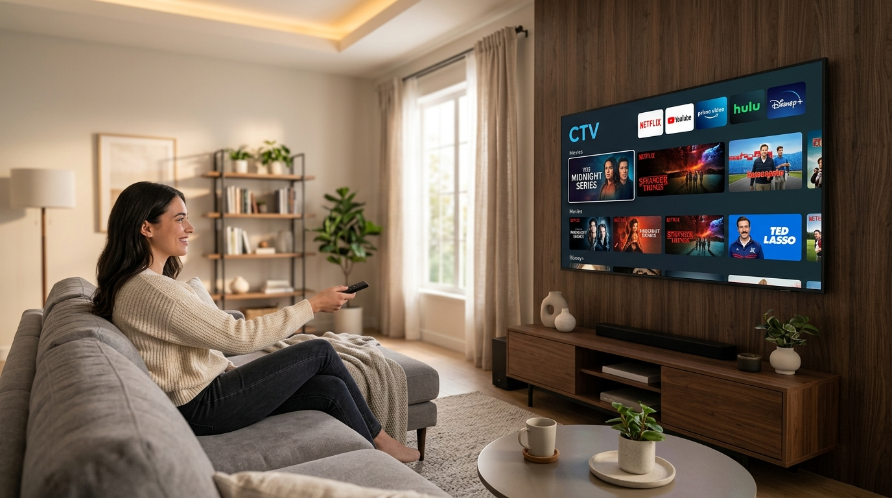

# 第9部：テレビ放送とインターネット動画配信の未来

### 本日の講義マップ —— アジェンダ

1. **映像テクノロジーの基礎と進化**（画素・走査線・インターレース vs プログレッシブ・超解像技術）
2. **映像端子とデジタル著作権の砦**（HDMI・HDCP・USB Type-Cの罠・DisplayPort）
3. **電波で届くテレビ放送の仕組み**（地デジ・BS/CS・B-CASからACASへ・放送法の激震）
4. **インターネット動画配信と「テレビ」の変容**（TVerとサイマル配信・VODの覇権・コネクテッドTVとチューナーレス）

---

### 本日の到達目標 —— リビングの画面とネット配信の裏側を解き明かす

* 画面解像度（FHD/4K/8K）と走査方式（インターレース vs プログレッシブ）の原理を説明できる
* HDMIとHDCP（暗号化著作権保護）、USB Type-CのAlt Modeの仕組みを理解する
* 地上波デジタルと衛星放送（BS/CS）の仕組み、CASによるアクセス制御を把握する
* TVerなどの見逃し配信・サイマル放送と、NetflixなどのVODビジネスモデルを比較できる
* チューナーレステレビの登場やNHKネット配信義務化など、テレビメディアの激変を考察できる

---

---

## 1. 映像テクノロジーの基礎と進化

### 考えてみたい問い

* テレビの「1080i」とYouTubeの「1080p」は何が違う？
* なぜ昔のアナログテレビ番組は横が黒帯（4:3）だったのか？
* 地デジや昔の映像が、最新の4K大画面で見てもなぜ綺麗に映るの？
* 1秒間に何コマ？ 映画（24fps）とテレビ（30fps）とゲーム（60/120fps）の違いとは？

---

### 画素（ピクセル）と画面解像度

#### 🔴🟢🔵 光の3原色が集まって映像を作る
* **ピクセル（Pixel / 画素）**：
  * デジタル画像を構成する最小単位の「点」。
  * 拡大すると、**赤（Red）・緑（Green）・青（Blue）**の3つの微小な光の明るさで無数の色を表現。
* **画面解像度（Resolution）**：
  * 画面に並んでいるピクセルの「横 × 縦」の総数。
  * **SD画質（昔のDVD・アナログ放送）**：720 × 480（約35万画素）
  * **フルHD（地デジ・Blu-ray）**：1920 × 1080（約207万画素）
  * **4K（最新テレビ・配信）**：3840 × 2160（**約829万画素＝フルHDの4倍！**）
  * **8K**：7680 × 4320（約3318万画素＝フルHDの16倍！）

---

### アスペクト比の歴史 —— 4:3から16:9、そして「縦型（9:16）」へ

#### 📐 人間の視界とデバイスに合わせた画面比率
* **アスペクト比**：画面の「横の長さ ： 縦の長さ」の比率。
* **4:3（スタンダード / アナログ時代）**：
  * かつてのブラウン管テレビや初期PCモニタの標準。
* **16:9（ワイド / 地デジ・ハイビジョン時代）**：
  * 人間の両目の視野角に近く、映画館のような臨場感を持つ現代テレビの黄金比。
* **9:16（縦型 / モバイル動画時代）**：
  * TikTok、YouTube Shorts、Instagramリールなど、**「スマホを片手で持ったままスクロールして見る」**現代の主流比率へ！

---

### 走査（スキャン）とは？ —— 画面を塗りつぶす順番

#### 🖌️ 1秒間に何十回も光の点を走らせる
* ディスプレイは、画面全体を一度に光らせているのではなく、**電子ビームや信号が「左から右、上から下」へと超高速でなぞる（走査 / スキャン）**ことで1枚の絵を作っています。
* 走査の方式には、歴史的に決定的な2つの規格が存在します：
  1. **インターレース走査（飛び越し走査：i）**
  2. **プログレッシブ走査（順次走査：p）**

---

### 【図解】インターレース（i）vs プログレッシブ（p）

```{mermaid}
flowchart TD
    subgraph Interlace["📺 インターレース走査（1080i / 地上波テレビ）"]
        direction TB
        I1["1回目：奇数行だけ描画（1, 3, 5...行）"] --> I2["2回目：偶数行だけ描画（2, 4, 6...行）"]
        INote["2回の走査で1枚の絵を完成！<br/>・少ない通信データ量で滑らかに見せる昔の知恵<br/>・静止画にすると横縞（チラつき）が出る弱点"]
    end
    
    subgraph Progressive["💻 プログレッシブ走査（1080p / PC・YouTube・配信）"]
        direction TB
        P1["上から1行ずつ順番に全部描画（1, 2, 3, 4, 5...行）"]
        PNote["1回で完全な1枚の絵を描画！<br/>・データ量は2倍だが、チラつきゼロで鮮明<br/>・PCモニタやスマホ、Netflix等の標準"]
    end
    style Interlace fill:#fff3e0,stroke:#e65100
    style Progressive fill:#e8f5e9,stroke:#2e7d32,stroke-width:2px
```

---

### 超解像技術（アップコンバート）とAI高画質化

#### 🔍 粗い映像を4K大画面で綺麗に見せる魔法
* **アップコンバートの必要性**：
  * 地上波テレビ（1080i / フルHD）の映像を、画素数が4倍ある「4Kテレビ」にそのまま拡大表示すると、画素がぼやけて粗くなってしまう。
* **超解像エンジン（テレビ内部プロセッサの処理）**：
  * **画素の補間・推測**：AIが被写体の輪郭、肌の質感、文字のエッジを推測し、**「もともとそこに存在したかのような高精細画素」を描き足して4K化**！
  * **フレーム補間（倍速駆動）**：秒間30コマや60コマの映像の間をつなぐ「中間のコマ」を瞬時に生成し、激しいスポーツも滑らかに表示。

---

### フレームレート（fps）の世界

#### 🎞️ 1秒間に何枚の画像をパラパラ漫画にするか
* **24 fps（映画）**：
  * 100年間変わらない映画の標準。適度な残像感（モーションブラー）が「映画らしいドラマチックな質感」を生む。
* **30 fps / 60フィールド（日本のテレビ放送）**：
  * ニュースやバラエティ番組の滑らかな標準。
* **60 fps 〜 120 fps（ゲーム・最新スマホ）**：
  * PS5やゲーミングPC、iPhoneのProMotionディスプレイ。カクつきが一切なく、競技性の高い対戦ゲームに必須。

---

---

## 2. 映像端子とデジタル著作権の砦

### 考えてみたい問い

* なぜ黄色・白・赤の「あのビデオ端子」は完全に姿を消したのか？
* なぜテレビのHDMIケーブルは、画面だけでなく「音」も送れるの？
* コネクタの形は同じなのに「画面が映らないType-Cケーブル」があるのはなぜ？
* 「HDCP」って何？ なぜゲーム実況者はHDMIキャプチャで苦労する？

---

### レガシーアナログ端子の終焉

#### 📼 ケーブルだらけだった時代の終わり
* **コンポジット端子（黄・白・赤ピン）**：
  * 黄色（映像）、白・赤（ステレオ音声）。SD画質（480i）しか送れず、色にじみが発生。
* **D端子（日本独自の悲劇の規格）**：
  * ハイビジョン（D3=1080i, D4=720p）に対応したアナログ端子だったが、**「暗号化されていないため高画質映像をそのままダビング（海賊版コピー）できてしまう」**という致命的欠点により全廃！
* **VGA端子（D-Sub 15ピン）**：
  * 昔のPC用アナログ映像端子。音声は送れず、徐々に姿を消す。

---

### HDMI（High-Definition Multimedia Interface）の覇権

#### 🔌 ケーブル1本で映像も音声も完璧に送るデジタル標準
* **HDMIの革命**：
  * 映像と音声を1本の細いケーブルで非圧縮デジタル伝送。
  * リモコン連動機能（CEC）：テレビの電源を入れるとゲーム機やレコーダーが連動して起動。
* **世代ごとの進化**：
  * **HDMI 1.4**：フルHD対応。
  * **HDMI 2.0**：4K 60Hzに対応。
  * **HDMI 2.1（最新）**：4K 120Hz / 8K対応、可変リフレッシュレート（VRR）。PS5などの最新ゲームに必須！

---

### 【図解】著作権保護技術「HDCP」の秘密

#### 🔐 画面に届くまで映像を暗号化して盗難を防ぐ
* **HDCP（High-bandwidth Digital Content Protection）**：
  * 映像を再生する機器（ゲーム機、PC、Blu-ray）と、表示するディスプレイの間で**暗号化ハンドシェイク**を実行！

```{mermaid}
flowchart LR
    A["🎮 再生機器<br/>（PS5 / レコーダー / PC）"] -->|① 暗号鍵の相互認証| B["📺 ディスプレイ<br/>（テレビ / モニタ）"]
    A -->|② 暗号化された映像信号を伝送| B
    B -->|③ ディスプレイ内部で復号して表示| B
    
    H["🦹 キャプチャ機器 / 海賊版コピー機<br/>（HDCP非対応）"] -.->|途中で抜き取ろうとする| A
    style H fill:#ffebee,stroke:#c62828,stroke-width:2px
    style B fill:#e8f5e9,stroke:#2e7d32
```

::: {.callout-warning title="⚠️ 画面が真っ暗になる原因"}
HDCP非対応の古いモニタや怪しい分配器に繋ぐと、著作権保護が働き、Netflixやゲーム画面が真っ暗になって映りません。
:::

---

### USB Type-C の万能性と「見えない落とし穴」

#### ⚡ 1本のケーブルで充電・通信・映像出力をすべてこなす
* **DisplayPort Alt Mode（オルタネートモード）**：
  * ノートPCやスマホのType-C端子から、直接HDMI/DisplayPort信号を出力して大画面モニタに映す機能。
  * **ケーブル1本で「ノートPCの画面を大画面に映しながら、モニタからノートPCへ急速充電（USB PD）」**できる神機能！
* **コネクタの形が同じでも中身が違う「Type-Cの罠」**：
  * ❌ **100均の充電専用ケーブル**：充電しかできない（映像もデータも不可）。
  * ❌ **スマホ付属ケーブル（USB 2.0速度）**：充電と低速転送のみ（映像出力非対応）。
  * ⭕ **USB4 / Thunderbolt 4ケーブル**：40Gbps超高速通信・4K/8K映像出力・高出力充電すべて対応。

---

---

## 3. 電波で届くテレビ放送の仕組み

### 考えてみたい問い

* なぜ2011年に「地デジ化」で日本中のテレビを買い替えることになったのか？
* 「地上波」「BS」「CS」は何が違う？ パラボラアンテナはどこを向いている？
* テレビの横に刺さっていた「赤いB-CASカード」はどこへ消えた？
* 「テレビを持っていなくても、スマホがあればNHK受信料を払う」時代が来るって本当？

---

### 2011年 地デジ完全移行の「本当の理由」

#### 📡 電波の有効利用とスマートフォンの爆発的普及
* 2011年7月24日、半世紀続いたアナログテレビ放送が終了し、地上波デジタル（地デジ）へ完全移行。
* **なぜ国を挙げて移行させたのか？**：
  * アナログ放送は広大な電波周波数を占有していた。
  * デジタル化（映像圧縮技術 MPEG-2）により、**同じ電波の幅で何倍もの番組を高画質（フルHD）で送れる**ようになった。
* **空いた「プラチナバンド」の行方**：
  * アナログ終了で空いた貴重な電波帯（700MHz〜900MHz）は、**急速に普及していた「スマートフォン（4G/LTE・5G）」の通信網へ再割り当て**されました！

---

### 地上波デジタル vs 衛星放送（BS / CS）

| 放送区分 | 送信方法 | 周波数・特徴 | 番組内容・利用形態 |
|:---|:---|:---|:---|
| **地上波デジタル（地デジ）** | 地上の電波塔（東京スカイツリー等）から送信 | UHF帯（極超短波）。障害物があれば中継局を設置。 | 地域ごとの地方局放送。無料。1080i放送。 |
| **BSデジタル（放送衛星）** | 宇宙の静止衛星（東経110度）から日本全土へ一括送信 | パラボラアンテナで受信。大雨で電波減衰あり。 | 全国一律放送。NHK、民放各社の無料BS、4K/8K放送。 |
| **CSデジタル（通信衛星）** | 宇宙の通信衛星（東経110度等）から送信 | スカパー等の専用アンテナ・契約。 | 専門性の高い有料多チャンネル（スポーツ、アニメ、映画）。 |

---

### 【図解】地上波デジタル・衛星放送（BS）・ネット配信の伝送ルート比較

```{mermaid}
flowchart TD
    subgraph Broadcast["📡 放送（電波：1対無制限の一括同報配信）"]
        Tower["🗼 電波塔（スカイツリー等）"] -->|地上UHF電波| Ant["🏠 魚の骨アンテナ（地デジ）"]
        Sat["🛰️ 静止衛星（東経110度）"] -->|12GHz帯マイクロ波| Para["📡 パラボラアンテナ（BS/CS）"]
    end

    subgraph Internet["🌐 ネット配信（IPパケット：個別通信）"]
        Origin["🏢 配信元（Netflix/TVer）"] --> CDN["⚡ CDNエッジサーバー群"]
        CDN -->|光回線 / 5G| NetTV["🖥️ スマートテレビ / スマホ"]
    end

    style Tower fill:#e1f5fe,stroke:#0288d1
    style Sat fill:#fff3e0,stroke:#f57c00
    style CDN fill:#e8f5e9,stroke:#2e7d32
```

::: {.callout-note title="💡 放送と通信の決定的な違い"}
放送は視聴者が1億人になってもサーバーダウンしません（電波を浴びるだけ）。一方、ネット配信はアクセスが集中するとCDNや配信サーバーがパンクするリスクを抱えています。
:::

---

### B-CASカードから「ACASチップ」への進化

#### 💳 テレビの横の「赤いカード」が消えた理由
* **B-CASカードの役目**：
  * テレビ放送は暗号化されて送信されており、B-CASカードの中の暗号鍵を使って復号（視聴）する仕組み。
* **不正書き換え事件の発生**：
  * 過去にカード内の暗号鍵やプログラムが解析され、有料放送を勝手にタダ見できる改造ツールが出回る事件が発生。
* **ACAS（新世代チップ）への移行**：
  * 2018年に始まった新4K8K衛星放送以降のテレビでは、カードを差し込む方式を全廃。
  * **テレビ本体の基板内に高度なセキュリティチップ（ACAS）を直接ハンダ付けで内蔵**し、物理的に抜き差し・改造できないように進化！

---

### 2024〜2025年 放送法の歴史的大改正 —— NHKネット配信義務化

#### 🏛️ 「テレビ設置」から「スマホでの利用」へ広がる受信料
* **放送法の改正（2024年成立・2025年施行）**：
  * これまでNHKのインターネット配信（NHKプラス）はテレビ放送の「補完業務」だったが、**「必須業務（本来業務）」へ格上げ**。
* **受信料の新しいルール**：
  * テレビを持たない人でも、**「スマホやPCでNHKのネット配信アプリをインストールし、利用登録（ID取得）して日常的に視聴する人」は受信料支払いの義務対象**に！
  * （※単にスマホを持っているだけ、またはブラウザで検索しただけでは請求されません）。

---

---

## 4. インターネット動画配信と「テレビ」の変容

### 考えてみたい問い

* なぜ最近の若者は「テレビ受像機」を持たず「TVer」や「YouTube」で済ませるのか？
* Netflix、Amazon Prime、U-NEXTはどうやって儲けている？
* ドン・キホーテで話題になった「チューナーレステレビ」が売れる理由とは？
* なぜサッカーW杯やボクシング世界戦が「地上波テレビ」で生中継されなくなったのか？

---

### 動画配信ビジネスの3大モデル

#### 💰 ネット配信はどうやってお金を稼いでいるのか？
* **SVOD（Subscription Video on Demand：定額見放題）**：
  * 月額定額制。広告なしで映画やドラマが見放題。
  * 例：Netflix, Amazonプライム・ビデオ, Disney+, U-NEXT
* **AVOD（Advertising Video on Demand：広告付き無料配信）**：
  * 視聴者は無料。途中で流れるCMの広告費で運営。
  * 例：YouTube, TVer, ABEMA無料枠
* **TVOD / PPV（Transactional VOD / Pay-Per-View：都度課金）**：
  * 映画1本ごとのレンタル・購入や、格闘技・アーティストの有料生配信。

::: {.callout-note title="最新トレンド「FAST」の台頭"}
欧米や日本で、広告付きで24時間番組を流し続ける無料のリニア配信（**FAST: Free Ad-supported Streaming TV**）が注目されています（ABEMAの専門チャンネルなど）。
:::

---

### 【図解】動画配信サービスのビジネス構造比較

```{mermaid}
flowchart LR
    subgraph SVOD["🎬 SVOD（定額サブスク）"]
        U1[利用者] -->|毎月定額（約1,000円〜）| P1["Netflix / Prime"]
        P1 -->|高画質・広告なし・オリジナル大作| U1
    end

    subgraph AVOD["📢 AVOD（広告型無料配信）"]
        U2[利用者] -->|無料視聴（アテンション提供）| P2["TVer / YouTube"]
        S2[広告主] -->|広告出稿料| P2
        P2 -->|CM挿入| U2
    end

    subgraph PPV["🎟️ TVOD / PPV（都度課金）"]
        U3[利用者] -->|1作品ごと・試合ごとに購入| P3["U-NEXT / ABEMA"]
        P3 -->|最新劇場版・格闘技ライブ生中継| U3
    end

    style SVOD fill:#e1f5fe,stroke:#0288d1
    style AVOD fill:#fff8e1,stroke:#ffa000
    style PPV fill:#ede7f6,stroke:#512da8
```

---

### TVerの爆発的普及と「サイマル同時配信」

#### 📺 テレビ番組を「時間と場所の束縛」から解放した
* **TVer（ティーバー）とは**：
  * 日本の民放キー5局が共同で立ち上げた公式見逃し配信サービス。
  * 放送後1週間、ドラマやバラエティを無料で見放題（AVOD）。
* **ゴールデンタイムの「サイマル配信（同時配信）」**：
  * 2021年以降、テレビの電波と同時にインターネットでも生配信。
* **テレビ局の評価軸の変化**：
  * かつての「世帯視聴率」至上主義から、若者がいつどこで何回見たかを示す**「TVer再生数・お気に入り登録数」**が番組の存続を左右する時代へ！

---

### 巨大資本の衝突 —— メガイベントの地上波撤退

#### ⚽ 放映権料の高騰とネット独占配信
* **地上波でビッグマッチが見られない時代**：
  * **2022年 サッカーW杯カタール大会**：サイバーエージェント（ABEMA）が全64試合を無料生中継。
  * **ボクシング井上尚弥戦**：Amazon Prime Videoが独占生配信。
  * **MLB大谷翔平戦**：ABEMAやSPOTV NOWが中継枠を獲得。
* **なぜテレビ局は買えないのか？**：
  * 世界的な配信大手の参入により、国際スポーツの放映権料が数百億〜数千億円へ暴騰。
  * テレビCMの広告収入だけではペイできず、有料会員獲得を狙うネット配信企業が放映権を独占する構造へシフト！

---

### コネクテッドTV（CTV）と「チューナーレステレビ」

#### 🖥️ テレビは「放送を受信する箱」から「大型スマートモニタ」へ
* **コネクテッドTV（CTV）**：
  * ネットに接続されたテレビ。Fire TV StickやApple TV、Google TV内蔵テレビの普及により、**リビングの大画面でYouTubeやNetflixを見るのが当たり前**に。
* **チューナーレステレビの大ヒット**：
  * 地デジやBSの受像チューナーを一切搭載せず、動画配信アプリだけが動くディスプレイ。
  * **なぜ売れるのか？**：
    1. チューナーがない分、**4K大画面でも3〜4万円台と圧倒的に安い**！
    2. テレビ放送を受信する設備ではないため、**NHK受信契約が不要**。
    3. 「リアルタイムのテレビは見ない、YouTubeとNetflixだけで十分」という単身世帯のニーズに完全に合致。

---

### 【生活風景】アンテナ線不要！ コネクテッドTVのある暮らし

{fig-align="center" width="75%"}

::: {.callout-note title="放送波からネット配信へシフトしたリビング"}
壁のアンテナ端子にケーブルを繋ぐことなく、Wi-Fiを通じてYouTubeやNetflix、TVerなどの動画配信サービスをリビングの4K大画面で楽しむスタイルが定着しています。
:::

---

### ミラーリング技術 —— 手元のスマホを居間の大画面へ

#### 📲 ケーブル不要でワイヤレス映像伝送
* **ミラーリング（Screen Mirroring）**：
  * スマホやPCの画面を、Wi-Fiを経由してテレビの大画面にそのまま映し出す技術。
* **主要なワイヤレス規格**：
  * **AirPlay（Apple）**：iPhone/Macの画面をApple TVや対応スマートテレビに秒速転送。
  * **Google Cast（Chromecast）**：YouTubeやNetflixの再生指示だけをテレビに送り、テレビ側で高画質ストリーミング再生。
  * **Miracast**：Wi-Fi Allianceによる業界標準規格。

---

### 📱 実践チェック

#### 🔍 我が家の映像・通信環境をチェックしてみよう
1. **テレビの裏側を覗いてみよう**：
   * 繋がっているケーブルは「HDMI」か？ 端子に「4K 120Hz」や「eARC」と書いてあるか確認しよう。
2. **テレビのスマート機能**：
   * 自宅のテレビにYouTubeやTVer、Netflixのボタンがあるか？ なければFire TV Stick等の外部機器がついているか確認しよう。
3. **PCやスマホのType-C**：
   * 手持ちのノートPCやスマホのType-C端子が「画面出力（DisplayPort Alt Mode）」に対応しているかスペック表を調べてみよう。

---

### 🤔 考えてみよう（講義の振り返り）

#### 💭 問いかけ
1. 「リアルタイムに同じ時間に同じ番組を見る」テレビ放送の文化は、オンデマンドや倍速視聴が当たり前になった現代社会で、今後どのような独自の価値（速報性、災害報道、国民的一体感など）を残していくだろうか？
2. チューナーレステレビの普及やNHKネット配信義務化が進む中、未来の「公共放送（公のメディア）」の費用負担はどうあるべきだろうか？

---

### 全9部作の完全完結 —— 現代デジタル社会の歩き方

#### 🏛️ あなたが手に入れた「9つのデジタル知性」
1. **認証（Part 1）**：パスキーとMFAで自己の存在証明を守る。
2. **通信（Part 2）**：暗号化と人の心の隙を突く攻撃を警戒する。
3. **データ（Part 3）**：検索技術とDBの構造で真実を見極める。
4. **決済（Part 4）**：FeliCa・NFC・QRの仕組みを知り、カード情報を守る。
5. **暗号通貨（Part 5）**：中央のないブロックチェーンの革新と自己責任を知る。
6. **SNS（Part 6）**：アルゴリズムに操られず、情報発信の責任を持つ。
7. **クラウド（Part 7）**：巨大ITの利便性を享受しつつ、データ主権を保つ。
8. **モバイル（Part 8）**：ポケットの中の電波と端末を自らコントロールする。
9. **映像・放送（Part 9）**：電波と配信が融合するメディアの未来を客観的に見抜く。

::: {.callout-tip title="🎓 デジタル教養の旅を終えたあなたへ"}
現代社会のあらゆるスクリーンと電波の裏側には、人類の知恵と暗号、通信プロトコル、そしてビジネスの思惑が張り巡らされています。仕組みを知ったあなたなら、デジタルに流されることなく、自らの知性と意志で未来を切り拓いていけます。素晴らしいデジタルライフを！
:::

