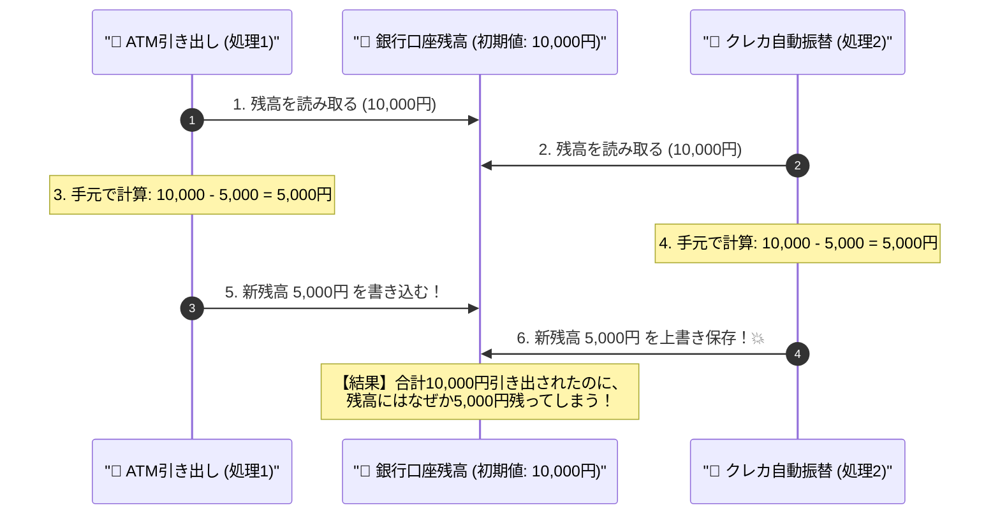

# 経済学とビジネスのための現代データベース入門

### 本日の講義マップ —— 全6章のアジェンダ

1. **Excelの限界と「関係モデル」の誕生**（更新時アノマリーと取引コスト）
2. **ビジネスをモデル化する（ER図とREAモデリング）**（会計学とリソース・イベント）
3. **データの整合性を守る「正規化」の技法**（1NF〜3NFと価格スナップショット）
4. **ビジネスデータを操るSQL**（集合の宣言、集約、JOIN結合）
5. **金融・取引を支える「トランザクション」とACID特性**（銀行送金と分離性の破壊）
6. **分散システムと社会インフラ（CAP定理と決済システム）**（CP vs AP、Google Spanner）

---

### 本日の到達目標 —— データの裏側にある「制度設計」を掴む

#### 🎯 本日の講義で身につく力

* 企業がなぜExcelではなくデータベース（RDB）を基幹に据えるのかを「アノマリー」から説明できる
* 複式簿記に基づく「REAモデリング」で、ビジネスルールを破綻なくモデル化できる
* 第1正規形〜第3正規形の本質と、あえて非正規化する「経済的例外（価格保持）」を理解できる
* 金融取引を担保する「ACID特性」と、並行処理で起きる経済的被害（ロストアップデート等）を防ぐ仕組みを把握する
* 分散インフラの物理限界である「CAP定理」と、Google Spannerが原子時計でねじ伏せた外部一貫性を論理的に説明できる

---

### はじめに：なぜ経済学部でデータベースを学ぶのか？

#### 🏛️ 現代経済・金融・企業組織の背後にあるDBMS

* **銀行口座間の資金移動**：
  * Aさんの口座から引き落とされた瞬間、Bさんの口座に同額が加算されなければならない（途中で通信が切れたら？）。
* **フリマアプリやチケット販売**：
  * 残り1点の限定商品に、同時に2人の買い手が購入ボタンを押したらどうなるか？
* **企業会計とサプライチェーン**：
  * 過去の販売単価を改定したとき、過去の決算書や売上明細の数字まで勝手に書き換わってしまわないか？

---

### 単なる「プログラミング」ではない —— 制度論的アプローチ

#### 📜 「データモデルの設計」＝「企業の制度設計」

* **データモデルの設計（制度設計）**：
  * ビジネスのルールや契約をいかに矛盾なくデータ構造に落とし込むか（モデリング・正規化）。
* **取引（トランザクション）の整合性保証**：
  * 市場や企業の取引をいかに安全・確実に成立させるか（ACID特性・分散システム）。
* データベースを学ぶことは、**経済活動と取引のルールを数理的・論理的に見通す思考のレンズを手に入れること**です！

---

## 1. Excelの限界と「関係モデル」の誕生

### 考えてみたい問い

* なぜ多くの企業が「Excelでの顧客・売上管理」で重大なトラブルを起こすのか？
* 1枚の大きな表にすべてを記録しようとすると、どんな矛盾（アノマリー）が起きる？
* 1970年に提唱された「リレーショナルモデル（関係モデル）」は何を解決したのか？

---

### 表計算シートが引き起こす3つの経済的損失

#### 📊 1枚の巨大なExcelシートで売上を管理する小売店の例

| 注文番号 | 注文日 | 顧客名 | 顧客電話番号 | 商品名 | 単価 | 数量 | 金額 |
|:---:|:---:|:---:|:---:|:---:|:---:|:---:|:---:|
| 1001 | 2026-04-01 | 田中 太郎 | 090-1111-XXXX | 経済学入門 | 2,800 | 1 | 2,800 |
| 1002 | 2026-04-02 | 佐藤 花子 | 080-2222-XXXX | 統計分析基礎 | 3,200 | 2 | 6,400 |
| 1003 | 2026-04-03 | 田中 太郎 | 090-1111-XXXX | 統計分析基礎 | 3,200 | 1 | 3,200 |

* 一見シンプルで分かりやすい表に見えます。
* しかし、ここにはデータベース工学で**「更新時アノマリー（Update Anomaly）」**と呼ばれる3大リスクが潜んでいます！

---

### ① 修正（更新）アノマリー：表記揺れと情報の非対称性

#### ✍️ 1箇所の変更で生じるデータの矛盾

* もし「田中 太郎」氏が電話番号を変更した場合：
  * 田中氏の過去の全レコードを探し出して、手動で更新しなければならない。
  * 1箇所でも修正漏れがあると、**「同じ顧客なのに注文履歴によって電話番号が異なる」**という深刻な不整合が発生！
* レコードが数十万件に達したとき、手作業での同期は完全に破綻します。

---

### ② 挿入アノマリー：存在しない取引の記録不能

#### 🚫 取引とマスタの同居が生む歪み

* **新規見込み客を登録したい場合**：
  * 「まだ一度も買い物をしたことがない顧客」の連絡先をこの表に登録しようとする。
  * すると、「注文番号」や「商品名」「金額」が存在しないため、**空欄（NULL）だらけの歪な行**を作らざるを得ない！
* 商品マスタや顧客情報を「取引の記録」と同一の表に同居させているために生じる本質的な欠陥です。

---

### ③ 削除アノマリー：意図せぬ情報の連鎖消滅

#### 🗑️ 注文のキャンセルで商品情報が消滅する悲劇

* 佐藤花子氏の注文（1002）がキャンセルになり、この行をシートから削除したとします。
* すると、**「統計分析基礎という商品が単価3,200円である」という商品マスタ情報そのものが社内から完全に消滅**してしまいます！
* 取引の取り消しが、企業の保有財産情報の消滅を招いてしまうのです。

---

### 💡 経済学的洞察：取引コストと情報の冗長性

::: {.callout-tip title="💡 ロナルド・コースの「取引コスト」と冗長性"}

同じデータを複数箇所に二重・三重に記録する状態（**冗長性**）は、単にPCのストレージを浪費するだけではありません。

* 「どれが最新の正しい情報なのか？」を確認するコスト
* 社内での情報の同期・突き合わせコスト
* 誤ったデータに基づいて誤発注や誤請求を起こす損失コスト

ノーベル経済学賞を受賞したロナルド・コースの言う**「取引コスト（Transaction Cost）」を組織内で爆発的に増大**させます。
:::

---

### コッドの関係モデル：テーブルを「独立した集合」に切り離す

#### 🧩 1970年、E. F. コッドが提唱した革命

* 数学者エドガー・F・コッド（E. F. Codd）の着想：
  * **「現実世界の事象を、意味のある独立した名詞（テーブル）ごとに分解し、共通の識別番号（ID）だけで結びつける」**。

:::: {.columns}
::: {.column width="50%"}
##### 【顧客テーブル (CUSTOMER)】
| 顧客ID (PK) | 氏名 | 電話番号 |
|:---:|:---|:---|
| **1** | 田中 太郎 | 090-1111-XXXX |
| **2** | 佐藤 花子 | 080-2222-XXXX |
:::
::: {.column width="50%"}
##### 【注文テーブル (ORDER)】
| 注文番号 (PK) | 顧客ID (FK) | 注文日 |
|:---:|:---:|:---:|
| 1001 | **1** | 2026-04-01 |
| 1002 | **2** | 2026-04-02 |
| 1003 | **1** | 2026-04-03 |
:::
::::

---

### 関係モデルによってアノマリーはどう解消されたか？

#### ✅ 3大問題の完全な克服

1. **修正アノマリーの解消**：
   * 田中氏の電話番号が変わっても、顧客テーブルの「1行」を書き換えるだけで完了。過去の全注文も自動的に新番号を参照！
2. **挿入アノマリーの解消**：
   * 買い物をしたことがない新規顧客も、顧客テーブルに単独で登録可能（注文列のNULLは発生しない）。
3. **削除アノマリーの解消**：
   * 注文がキャンセルされて注文レコードを削除しても、顧客マスタや商品マスタは無傷のまま残る！

---

### 📱 実践チェック

#### 📊 関係モデルの基本原則を確認

* 主キー（PK: Primary Key）と外部キー（FK: Foreign Key）の違いは何か？
  * **主キー（PK）**：そのテーブル内でレコードを唯一無二に特定する背番号（例：顧客ID）。
  * **外部キー（FK）**：別のテーブルの主キーを参照し、関係性を結ぶための番号（例：注文テーブル内の顧客ID）。

---

### 🤔 考えてみよう（振り返り）

* 大学の教務システムを1枚のExcelシートで作った場合、どんなアノマリーが起きるだろうか？
* 「休学中の学生」「まだ履修者が0人の新設科目」を登録する場合を想像してみよう。

---

## 2. ビジネスをモデル化する（ER図とREAモデリング）

### 考えてみたい問い

* 現実の複雑なビジネスを、どうやって整然としたデータベースの設計図に落とし込むのか？
* 会計学の「複式簿記」の考え方が、なぜ現代のデータ設計の強力な指針になるのか？
* 「注文」と「商品」を直接つないではいけない理由とは？

---

### 会計学から生まれた「REAモデリング」

#### 🏛️ ウィリアム・マッカーシー教授の洞察

* ミシガン州立大学のウィリアム・マッカーシー（W. E. McCarthy）教授が提唱。
* 複式簿記の「原因と結果」「富のストックとフロー」の構造をデータベース設計に応用した理論。
* ビジネスのデータは、必ず以下の**3要素（リソース・イベント・エージェント）**に大別されます。

```{mermaid}
flowchart LR
    R["📦 リソース (Resource)<br/>企業の富・ストック<br/>[商品] [預金口座]"]
    E["⚡ イベント (Event)<br/>富の移転・フロー<br/>[注文] [出荷] [振込決済]"]
    A["👤 エージェント (Agent)<br/>取引の当事者<br/>[顧客] [従業員] [取引先]"]

    A -->|取引を実行| E
    E -->|資源を増減| R
    style R fill:#e3f2fd,stroke:#1565c0
    style E fill:#fff3e0,stroke:#e65100
    style A fill:#e8f5e9,stroke:#2e7d32
```

---

### REAモデリングの3大構成要素

| 要素 | 概念 | ビジネス上の具体例 | テーブルの性質 |
|:---|:---|:---|:---|
| **リソース<br/>(Resource)** | 企業が保有する富・ストック。<br/>時間の経過で急変しない資源。 | 商品、預金口座、倉庫、設備 | **マスタテーブル**<br/>（状態を保持） |
| **イベント<br/>(Event)** | 資源を増減させる経済的事象。<br/>不可逆な富の移転（フロー）。 | 受注、出荷、入金、契約、振込 | **トランザクションテーブル**<br/>（履歴・ログを保持） |
| **エージェント<br/>(Agent)** | 取引に関与する経済的主体。<br/>取引の当事者。 | 顧客、従業員、取引先銀行 | **マスタテーブル**<br/>（属性を保持） |

---

### 📌 設計の黄金律：イベントは「追記のみ」で運用する

::: {.callout-important title="📌 内部統制と監査証跡の基本原則"}

**「イベント（動詞）」は一度発生したら過去の確定した事実である。**

* したがって、イベント系テーブル（注文、出荷、決済ログなど）のレコードは、原則として**書き換え（UPDATE）や削除（DELETE）を行ってはならない**！
* 修正が必要な場合は、「マイナスの赤伝票（取消イベント）」を新しく**追記（INSERT）**することで相殺する。
* これが近代的な会計監査・内部統制・監査証跡（Audit Trail）の鉄則です。
:::

---

### カラスの足（IE記法）で取引の「関係性」を定義する

#### 🐦 実務で広く使われるER図の視覚記法

エンティティ同士が「何対何の対応関係にあるか（多重度 / カーディナリティ）」を直感的な線で表現します。

* `┼──┼` ： **1対1（必須）**（例：国と首都）
* `┼──<` ： **1対多（必須）**（例：1つの注文と、それに含まれる1つ以上の注文明細）
* `○──<` ： **1対多（任意）**（例：顧客と注文。一度も注文したことがない顧客も許容）

---

### 【ER図】小売ビジネスの全体データモデル

```{mermaid}
erDiagram
    CUSTOMER ||--o{ ORDER : "注文する (1対多/任意)"
    ORDER ||--|{ ORDER_ITEM : "含む (1対多/必須)"
    PRODUCT ||--o{ ORDER_ITEM : "含まれる (1対多/任意)"

    CUSTOMER {
        int id PK "顧客ID"
        string name "氏名"
        string phone "電話番号"
    }
    ORDER {
        int id PK "注文番号"
        int customer_id FK "顧客ID"
        date order_date "注文日"
    }
    ORDER_ITEM {
        int order_id PK_FK "注文番号"
        int product_id PK_FK "商品ID"
        int quantity "数量"
        int purchase_price "購入時単価"
    }
    PRODUCT {
        int id PK "商品ID"
        string name "商品名"
        int list_price "定価"
    }
```

---

### 多対多の解消：なぜ「注文明細」が必要なのか？

#### ⚠️ 「注文」と「商品」を直接結んではいけない理由

* 現実世界の商取引を観察してみましょう：
  * 1回の「注文」には、**複数の「商品」**が含まれます。
  * 1つの「商品」は、世界中の**複数の「注文」**に選ばれます。
* これは**多対多（N:M）**の関係です。
* しかし、関係データベースではテーブル同士を「多対多」の線で直接つなぐことができません！
  * なぜなら、**「どの注文に、どの商品が何個（数量）、いくらで含まれるか」を記録する場所がなくなってしまう**からです。

---

### 連関エンティティ（中間テーブル）の魔法

#### 🔗 「多対多」を「2つの1対多」に分解する

```{mermaid}
flowchart LR
    O["📦 注文 (ORDER)"] -->|1対多| OI["📝 注文明細 (ORDER_ITEM)<br/>【連関エンティティ】<br/>注文ID + 商品ID + 数量 + 単価"]
    P["🏷️ 商品 (PRODUCT)"] -->|1対多| OI

    style OI fill:#fff9c4,stroke:#fbc02d,stroke-width:2px
```

* 両者の間に**連関エンティティ（中間テーブル）「注文明細（ORDER_ITEM）」**を挟む。
* これにより、多対多の複雑な関係が「整然とした2つの1対多」に分解され、数量や購入時単価を正確に管理できるようになります。

---

### 📱 実践チェック

#### 📐 REAモデリングの確認

* 大学の履修登録システムをREAでモデル化すると：
  * **リソース**：講義（開講科目）、教室
  * **エージェント**：学生、担当教員
  * **イベント**：履修登録（いつ、どの学生が、どの科目を登録したか）
  * 学生と科目の多対多を解消する連関エンティティは「履修データ」！

---

### 🤔 考えてみよう（振り返り）

* Uber Eatsのような配達サービスをREAモデリングする場合：
  * 「レストラン」「配達員」「注文者」「料理」「配達イベント」はそれぞれリソース・イベント・エージェントのどれに分類されるだろうか？

---

## 3. データの整合性を守る「正規化」の技法

### 考えてみたい問い

* テーブルを分ける基準は何？ どこまで細かく分ければいいの？
* 「第1正規形」「第2正規形」「第3正規形」は何を排除しているのか？
* 「商品の単価」を注文明細テーブルにあえて重複して保存するのは、なぜ経済的に不可欠なのか？

---

### 正規化（Normalization）理論とは？

#### 📐 「テーブルをどう分ければ安全か？」への数学的回答

* 直感や思いつきでテーブルを設計すると、後から必ずデータの破綻やアノマリーが発生します。
* **正規化**とは、データの重複や不整合を防ぐために、**数学的な従属関係に基づいてテーブルを段階的に無駄のない形へ分解する手続き**です。
* ビジネス実務においては、**第3正規形（3NF）**までを正しく理解し適用できれば十分です！

---

### 3.1 第1正規形（1NF）：繰り返し項目の排除

#### 🚫 ルール：1つのセルに複数の値（配列・カンマ区切り）を入れてはならない！

##### 【非正規形（違反例：1セルに複数の値が存在）】
| 学生番号 | 氏名 | 履修科目 |
|:---:|:---:|:---|
| S01 | 田中 | マクロ経済学, 計量経済学, 財政学 |
| S02 | 佐藤 | ミクロ経済学 |

* Excelではよく見かける形式ですが、データベースでは大惨事になります：
  * 「計量経済学を履修している学生」を高速に検索できない（部分一致検索になり激重）。
  * 履修科目ごとの学生数を集約（COUNT）できない。

---

### 第1正規形（1NF）への変換

#### 📏 すべてのセルを「単一のスカラー値」に展開する

##### 【第1正規形（1NF化達成）】
| 学生番号 (PK) | 履修科目 (PK) | 氏名 |
|:---:|:---|:---:|
| **S01** | **マクロ経済学** | 田中 |
| **S01** | **計量経済学** | 田中 |
| **S01** | **財政学** | 田中 |
| **S02** | **ミクロ経済学** | 佐藤 |

* 主キーは `(学生番号, 履修科目)` の**複合主キー**になります。
* これでSQLによる検索や集計が可能になりましたが、田中氏の「氏名」が3行も重複して出現する新たな問題が生じます。

---

### 3.2 第2正規形（2NF）：部分関数従属の排除

#### 🚫 ルール：複合主キーの「一部分」だけで決まる列を別テーブルに分離する！

上記の表に各科目の「担当教員」が加わった場合を考えます。

##### 【第2正規形違反（部分関数従属が存在）】
| 学生番号 (PK) | 履修科目 (PK) | 氏名 | 担当教員 |
|:---:|:---|:---:|:---:|
| S01 | マクロ経済学 | 田中 | 齊藤教授 |
| S01 | 計量経済学 | 田中 | 神取教授 |
| S02 | ミクロ経済学 | 佐藤 | 神取教授 |

* 各列が「何によって一意に決まるか（関数従属）」を観察します：
  * **氏名**は、複合キーの片割れである「**学生番号**」さえ分かれば決まる（科目は関係ない）。
  * **担当教員**は、複合キーの片割れである「**履修科目**」さえ分かれば決まる（学生は関係ない）。

---

### 第2正規形（2NF）への分解

#### ✂️ キーの一部に甘えている列を独立させる

主キー全体 `(学生番号, 履修科目)` に依存していない列を独立したテーブルに分離します。

:::: {.columns}
::: {.column width="33%"}
##### 【学生マスタ】
| 学生番号(PK) | 氏名 |
|:---:|:---|
| S01 | 田中 |
| S02 | 佐藤 |
:::
::: {.column width="33%"}
##### 【科目マスタ】
| 科目名(PK) | 担当教員 |
|:---|:---|
| マクロ経済学 | 齊藤教授 |
| 計量経済学 | 神取教授 |
| ミクロ経済学 | 神取教授 |
:::
::: {.column width="34%"}
##### 【履修実績】
| 学生番号(FK) | 科目名(FK) |
|:---:|:---|
| S01 | マクロ経済学 |
| S01 | 計量経済学 |
| S02 | ミクロ経済学 |
:::
::::

* これで第2正規形が達成され、氏名や担当教員の重複更新漏れが消滅します！

---

### 3.3 第3正規形（3NF）：推移的関数従属の排除

#### 🚫 ルール：主キー以外の列によって決まる別の列（芋づる式の従属）を分離する！

主キーが単一の「社員番号」である社員テーブルを考えます。

##### 【第3正規形違反（推移的関数従属を含むテーブル）】
| 社員番号 (PK) | 社員名 | 部署コード | 部署名 | 部署フロア |
|:---:|:---:|:---:|:---:|:---:|
| E101 | 田中 | D01 | 経済調査部 | 7階 |
| E102 | 佐藤 | D01 | 経済調査部 | 7階 |
| E103 | 鈴木 | D02 | 資金運用部 | 8階 |

* 従属の流れを追うと：
  * **社員番号 $	o$ 部署コード $	o$ 部署名, 部署フロア**
* 主キーが決まると部署コードが決まり、その部署コードによって部署名とフロアが決まる（**A $	o$ B $	o$ C の「また貸し」関係**）。

---

### 第3正規形（3NF）への分解

#### 🏢 部署が移転した時の全社員一括更新リスクを排除する

もし「経済調査部」が8階に移転した場合、社員テーブル全員のフロアを更新しなければならないリスクを解消します。

:::: {.columns}
::: {.column width="50%"}
##### 【社員テーブル】
| 社員番号 (PK) | 社員名 | 部署コード (FK) |
|:---:|:---:|:---:|
| E101 | 田中 | D01 |
| E102 | 佐藤 | D01 |
| E103 | 鈴木 | D02 |
:::
::: {.column width="50%"}
##### 【部署マスタ】
| 部署コード (PK) | 部署名 | 部署フロア |
|:---:|:---:|:---:|
| D01 | 経済調査部 | 7階 |
| D02 | 資金運用部 | 8階 |
:::
::::

* これで部署情報が独立マスタとして管理され、更新アノマリーは完全に消滅します！

---

### 3.4 経済的例外：なぜ「購入時単価」はあえて重複させるのか？

#### ❓ 理論とビジネス実務の決定的な対立

* **純粋な理論派の疑問**：
  * 「商品単価は商品マスタにあるのだから、注文明細テーブルに単価を持たせるのは正規化違反（重複）ではないか？」
* **ビジネス実務の現実**：
  * **いいえ、注文明細には絶対に「購入時単価」を重複して持たせなければなりません！**

```{mermaid}
flowchart LR
    P["🏷️ 商品マスタ<br/>商品ID: P001<br/>定価: 2,800円"] -->|物価高騰で価格改定| P_NEW["🏷️ 商品マスタ<br/>商品ID: P001<br/>定価: 3,500円 🔺"]
    OI["📝 注文明細（過去の確定注文）<br/>注文ID: 101, 商品: P001<br/>購入時単価: 2,800円（固定保存）"]

    style OI fill:#e8f5e9,stroke:#2e7d32,stroke-width:2px
```

---

### もし注文明細に単価を残さなかったら何が起きるか？

#### 💥 過去の決算書まで勝手に書き換わる粉飾事故！

* もし注文明細に単価を持たせず、常に商品マスタの定価を参照していたら：
  * 将来、商品の定価が値上げされた瞬間に、**「過去の会計年度の売上実績データまで勝手に値上がりしてしまう」**！
  * すでに税務署に提出した確定申告や決算書の売上金額と、システムの売上集計が一致しなくなる大事故を引き起こします。

::: {.callout-note title="📝 理論と実務の調和"}
* **マスタデータ（現在の値）**：徹底して第3正規形まで分離する。
* **トランザクションデータ（過去の合意価格）**：契約が締結された瞬間の**スナップショット**として、あえて値を固定・重複保存する。
:::

---

### 📱 実践チェック

#### 📐 正規化のまとめ

* **第1正規形 (1NF)**：1つのマスに複数の値を入れない（スカラ値化）。
* **第2正規形 (2NF)**：複合キーの一部だけで決まる列を切り離す。
* **第3正規形 (3NF)**：主キー以外の列に芋づる式に従属する列を切り離す。
* **意図的な非正規化**：過去の取引スナップショット（購入時単価など）は固定保持する！

---

### 🤔 考えてみよう（振り返り）

* ネット通販で「届け先住所」を注文テーブルに記録せず、常に顧客マスタの現住所を参照するように設計した場合、どんなトラブルが起きるだろうか？

---

## 4. ビジネスデータを操るSQL

### 考えてみたい問い

* Pythonなどの一般的なプログラミング言語とSQLは何が根本的に違うのか？
* 売上分析で最も使われる「GROUP BY」と「HAVING」の役割は？
* バラバラに分けた正規化テーブルを、どうやって元の1つの表に復元するのか？

---

### SQL（Structured Query Language）の特徴

#### 📢 「手続き（How）」ではなく「集合の条件（What）」を宣言する

* **一般的な言語（Python, C, Javaなど）**：
  * 「データを1行ずつループで回し、もし条件に合致したらリストに追加する」（手続き的命令）。
* **SQL**：
  * 「東京都に住んでいて、年間購買額が10万円以上の顧客の集合を出せ！」と**望むデータの条件だけを宣言**する（宣言型言語）。
  * どのようにインデックスを使い、どう効率的に探索するかは、DBMS内部の**オプティマイザ（最適化エンジン）**が全自動で計算して実行する！

---

### 4.1 基本構文：SELECT-FROM-WHERE

#### 🔍 欲しい列を選び（射影）、対象の行を絞り込む（選択）

```sql
-- 年間購買総額が10万円を超える東京都在住の顧客を抽出する
SELECT
    customer_id,
    name,
    total_spend
FROM
    customers
WHERE
    prefecture = '東京都'
    AND total_spend >= 100000;
```

* **SELECT** ：取得したい属性（列）を指定（関係代数の「**射影 $\pi$**」）
* **FROM** ：検索対象のテーブルを指定
* **WHERE** ：抽出するレコードの条件を指定（関係代数の「**選択 $\sigma$**」）

---

### 4.2 データの集約とグループ化：GROUP BY と HAVING

#### 📈 売上分析やマクロ集計における最重要構文

```sql
-- 2026年の月別売上合計を算出し、売上が100万円を超えた月だけを抽出
SELECT
    DATE_TRUNC('month', order_date) AS order_month,
    COUNT(order_id)                  AS total_orders,
    SUM(total_amount)               AS monthly_revenue
FROM
    orders
WHERE
    order_date BETWEEN '2026-01-01' AND '2026-12-31'
GROUP BY
    DATE_TRUNC('month', order_date)
HAVING
    SUM(total_amount) >= 1000000
ORDER BY
    order_month ASC;
```

---

### ⚠️ WHERE と HAVING の決定的な違い

::: {.callout-warning title="⚠️ 初心者が最も混同しやすいポイント"}

* **WHERE**：
  * **集約（GROUP BY）する前**の個々のレコードに対する絞り込み。
  * 例：`WHERE order_date >= '2026-01-01'`（2026年の注文レコードだけを対象にする）。
* **HAVING**：
  * **集約（GROUP BY）でまとめた後**の集計結果に対する絞り込み。
  * 例：`HAVING SUM(total_amount) >= 1000000`（月売上合計が100万円以上のグループだけを残す）。
:::

---

### 4.3 テーブル同士の結合：JOIN

#### 🧩 正規化でバラバラにした表を、必要な瞬間に1つに復元する

```sql
-- 顧客ごとの購入履歴を一覧化する（内部結合）
SELECT
    c.name             AS customer_name,
    o.order_id,
    o.order_date,
    p.name             AS product_name,
    oi.quantity,
    oi.purchase_price
FROM customers c
INNER JOIN orders o       ON c.id = o.customer_id
INNER JOIN order_items oi ON o.id = oi.order_id
INNER JOIN products p     ON oi.product_id = p.id;
```

* 顧客、注文、注文明細、商品の4つの正規化テーブルが、IDをキーにして一瞬で1つの明細表として復元されます。

---

### 内部結合（INNER JOIN） vs 外部結合（LEFT OUTER JOIN）

:::: {.columns}
::: {.column width="50%"}
#### 🔵 内部結合 (INNER JOIN)
* **両方に共通するデータのみ結合**
* 注文実績が1件でもある顧客だけが表示される。
* 「一度も注文したことがない新規顧客」は結果から除外される。
:::
::: {.column width="50%"}
#### 🟡 外部結合 (LEFT OUTER JOIN)
* **左側のテーブルを全件残す**
* 「一度も注文したことがない顧客」も含めて全顧客を表示したい場合に使用。
* 注文がない部分の列は自動的に**NULL**で埋められる。
:::
::::

* 「休眠顧客リストの作成」や「未購入者への販促メール配信」には LEFT OUTER JOIN が不可欠です。

---

### 📱 実践チェック

#### 💻 SQLの基本動作を確認

* 以下の集計を行いたい場合、どの構文を使うか？
  * 「各支店の売上平均を求め、平均売上が500万円以上の支店を表示する」
  * 支店ごとにまとめる $	o$ `GROUP BY 支店名`
  * 平均売上が500万以上 $	o$ `HAVING AVG(売上) >= 5000000`

---

### 🤔 考えてみよう（振り返り）

* 全顧客に対してアンケートを送りたいとき、INNER JOIN と LEFT OUTER JOIN のどちらを使って顧客リストを作成すべきだろうか？

---

## 5. 金融・取引を支える「トランザクション」とACID特性

### 考えてみたい問い

* 銀行の預金送金中にサーバーの電源コードが抜けたら、お金はどうなる？
* 残高1万円の口座から、ATMと口座振替が同時に5千円引き落としたらなぜ銀行が大損する？
* データベースが守り抜く「ACID特性」の4つの約束とは？

---

### 経済学における「契約・決済」とトランザクション

#### 🤝 中途半端な状態で終わることは絶対に許されない

* 経済活動における「契約」や「決済」は、完了するか、破棄されるかの二者択一です。
* **トランザクション（Transaction）**：
  * **「複数の関連する処理をひとまとめにし、すべて成功するか、すべて失敗するかのどちらかしか許さない不可分の処理単位」**。

```sql
-- 銀行口座間の送金トランザクション例
[ トランザクション開始: BEGIN ]
1. Aさんの残高を 10,000円減らす
   UPDATE accounts SET balance = balance - 10000 WHERE id = 'A';
2. Bさんの残高を 10,000円増やす
   UPDATE accounts SET balance = balance + 10000 WHERE id = 'B';
[ トランザクション確定: COMMIT ]
```

* もしステップ1の直後に大停電が起きたら？ Aさんのお金が虚空に消滅してしまう！

---

### トランザクションの4大保証：ACID特性

| 特性 | 英語名称 | 経済的・ビジネス的意味 |
|:---|:---|:---|
| **原子性** | **Atomicity** | **「全か無か（All or Nothing）」**。<br/>処理が途中で失敗したら、最初から何も起きなかった状態へ完全に巻き戻す（**ROLLBACK**）。中途半端な蒸発を許さない。 |
| **一貫性** | **Consistency** | **「ルールの厳守」**。<br/>残高マイナス禁止などの整合性制約や、二重振込の禁止といった事前定義ルールを破る更新を絶対に拒絶する。 |
| **分離性** | **Isolation** | **「並行処理の独立性」**。<br/>同時に1万人が取引していても、お互いの途中経過は見えず、あたかも自分1人だけが順番に処理しているかのように見せる。 |
| **耐久性** | **Durability** | **「確定した契約の永続性」**。<br/>一度コミットされたデータは、直後に大停電やOSクラッシュが起きても、ログ（WAL）から確実に復元される。 |

---

### 5.2 分離性（Isolation）が破綻すると起きる経済的被害

#### 💥 複数のユーザーが同時に同じデータを触る恐怖

複数の取引が同時に並行実行されるとき、分離レベルが低いと以下のような致命的な経済的事故（アノマリー）が発生します。

1. **ロストアップデート（更新の喪失）**：他人の更新を上書きして消してしまう。
2. **ダーティリード（汚れた読み取り）**：確定していない未完了のデータを読んでしまう。
3. **ファントムリード（幻影の出現）**：集計中に他人がデータを挿入し、集計が合わなくなる。

---

### ① ロストアップデート（更新の喪失）：銀行が大損するシナリオ

#### 💸 残高10,000円の口座から、同時に5,000円ずつ引き落とされた場合



* 処理1の引き落とし結果が、処理2によって上書きされて消滅（喪失）。銀行は5,000円の丸損になります！

---

### ② ファントムリード（幻影の出現）：経理の集計が狂う

#### 👻 集計中に新しい取引が割り込んでコミットされる

* **経理担当者の集計作業**：
  1. 「今月の売上レコードの合計金額」を集計クエリで計算する（例：合計5,000万円）。
  2. その直後、明細の個別チェックを行う。
  3. そのわずか数秒の間に、別の営業担当者が「新しく300万円の売上レコード」を追加してコミット！
  4. 経理担当者がもう一度合計を出すと、**さっきと数字が合わず、幽霊のような明細が出現している**！

---

### データベースはどうやって分離性を守るのか？

#### 🔒 2大防衛テクノロジー：行ロックとMVCC

:::: {.columns}
::: {.column width="50%"}
##### 1. 行ロック（Pessimistic Lock）
* **「触っている間は鍵をかける」**
* 処理1が口座データを読んだ瞬間にロックを掛け、処理2を待たせる。
* 確実だが、並行アクセスが多いと待ち行列ができて遅くなる。
:::
::: {.column width="50%"}
##### 2. MVCC（多版同時実行制御）
* **「過去のスナップショットを見せる」**
* 更新中であっても、読み取りトランザクションには「処理開始時点の過去バージョン」を見せる。
* 「読み取りは書き込みをブロックせず、書き込みは読み取りをブロックしない」超高速処理を実現！
:::
::::

---

### 📱 実践チェック

#### 🏦 トランザクションの確認

* チケット予約サイトで「残り1枚の座席」を2人が同時に購入しようとした場合：
  * トランザクションと行ロックが正しく機能していれば、0.001秒早く確定した1人だけが購入でき、もう1人には「すでに売り切れました」と安全にロールバックされる！

---

### 🤔 考えてみよう（振り返り）

* 証券取引所の株式売買システムで「分離性（Isolation）」が破綻した場合、どんな不公正取引や市場混乱が起きるだろうか？

---

## 6. 分散システムと社会インフラ（CAP定理と決済システム）

### 考えてみたい問い

* 巨大なWebサービスは、なぜ1台のスーパーコンピュータではなく世界中に分散したサーバー群で動くのか？
* 分散システムにおける「究極のトレードオフ」を証明したCAP定理とは？
* Googleはなぜ「原子時計」をデータセンターに配備して世界規模のデータベースを作ったのか？

---

### 単一サーバーの限界と分散システムの必然性

#### 🌍 地震・火災・アクセス集中に耐えるためのインフラ

* **スケールアップ（1台を巨大化）の限界**：
  * どんなに高価なサーバーでも、CPUやメモリの物理的上限がある。
  * その1台が雷や火災で壊れたら、全世界のサービスが全滅する（単一障害点）。
* **スケールアウト（安価な多数のサーバーに分散）**：
  * 世界中のデータセンターに何千台ものサーバーを配置し、ネットワークで繋いで1つの巨大なデータベースとして協調動作させる。
* しかし、ここには**物理法則に起因する絶対的な壁**が存在します！

---

### 6.1 CAP定理：完璧な分散システムは存在しない

#### ⛰️ エリック・ブリュワーが証明した「不可能な三位一体」

カリフォルニア大学バークレー校のエリック・ブリュワー（E. Brewer）が提唱した定理。分散データストアにおいて、**以下の3つの特性のうち3つすべてを同時に満たすことは数学的に不可能**である！

```{mermaid}
flowchart TD
    C["一貫性 (Consistency)<br/>全員が常に最新の同一データを見る"]
    A["可用性 (Availability)<br/>障害時も必ず即座に正常応答を返す"]
    P["分断耐性 (Partition Tolerance)<br/>ネットワーク回線が切断されても稼働する"]

    C --- A
    A --- P
    P --- C
    style C fill:#ffcdd2,stroke:#d32f2f
    style A fill:#c8e6c9,stroke:#388e3c
    style P fill:#bbdefb,stroke:#1976d2
```

---

### CAP定理の3大要素と現実の制約

1. **一貫性（Consistency）**：
   * どのサーバーに問い合わせても、必ず最新の同一データが返る（データの不整合がゼロ）。
2. **可用性（Availability）**：
   * 一部のサーバーが故障しても、システム全体はエラーを返さず必ず即答し続ける。
3. **分断耐性（Partition Tolerance）**：
   * サーバー間の通信回線が切断（ネットワーク分断）されてもシステムが破綻しない。

::: {.callout-important title="現実の物理法則による制約"}
現実に存在する地球規模のネットワークである以上、海底ケーブルの切断やルータ故障などの**「ネットワーク分断（P）」をゼロにすることは絶対に不可能**です。
したがって、現代のシステム設計は実質的に**「CP」か「AP」かの二者択一**を迫られます！
:::

---

### CPを選択するシステム：銀行口座・証券取引所

#### 🏦 「止めてでも誤りを防ぐ」（Consistency & Partition Tolerance）

* **設計思想**：
  * **「誤った残高を表示したり二重送金が起きるくらいなら、一時的にシステムを止めて利用者を待たせた方が100万倍マシである」**。
* **分断時の挙動**：
  * 東京とニューヨークの間の海底ケーブルが切断された場合、データの整合性を守るために、両拠点で同期が取れない処理は意図的にエラーを返して停止する。
  * 経済的・法的な正確性を最優先するシステム。

---

### APを選択するシステム：SNS・動画配信・EC閲覧履歴

#### 📱 「古くても即答する」（Availability & Partition Tolerance）

* **設計思想**：
  * **「いいねの数が1秒遅れて反映されたところで誰も破産しない。画面が真っ白になって使えなくなる方がユーザー体験として最悪である」**。
* **分断時の挙動**：
  * 通信が途切れていても、各サーバーは手元にある「少し古いかもしれないデータ」をひとまず即座に画面に表示する（結果整合性 / Eventual Consistency）。
* サービス停止によるユーザー離脱を最優先で防ぐシステム。

---

### CP vs AP の比較まとめ

| 選択 | 最優先事項 | ネットワーク分断時の挙動 | 代表的な適用システム |
|:---:|:---|:---|:---|
| **CP** | **データの一貫性・正確性**<br/>（嘘のデータは絶対悪） | 整合性が取れない場合は**処理を停止・エラー返却** | 銀行送金、暗号資産、証券取引、航空券予約 |
| **AP** | **システムの無停止・高可用性**<br/>（画面停止は絶対悪） | 古いかもしれないデータを**ひとまず即答・後で同期** | X (Twitter) のいいね、YouTube再生回数、閲覧履歴 |

---

### 6.2 究極の技術：Google Spannerと原子時計

#### ⏱️ 「全世界で分散しながら、厳密な一貫性（CP）を実現できないか？」

* 従来の常識：地球規模でサーバーを分散させると、光の速度の限界により通信遅延が生じ、厳密な一貫性（CP）を保つと激遅になってしまう。
* **2012年、Googleが発表した驚愕のシステム「Google Spanner」**：
  * 世界中のGoogleデータセンターに**GPS受信機とルビジウム原子時計**を物理的に配備！
  * サーバー間の時計のズレ（不確実性区間 $arepsilon$）を**わずか数ミリ秒以下**に抑え込む技術「TrueTime API」を開発。

---

### アインシュタインの相対性理論をねじ伏せた分散DB

#### 🛰️ 物理学の限界をハードウェアの物量とアルゴリズムで克服

* **なぜ原子時計が必要だったのか？**：
  * 地球上のサーバー同士は、光速の限界や相対性理論（重力や速度による時間の進み方の差）により、完全に同じ「現在時刻」を共有できない。
  * Googleは「時間のズレの最大幅（数ミリ秒）」を数学的に保証し、**そのズレの時間だけ意図的にコミットを待機する（Wait-out-the-uncertainty）**アルゴリズムを構築！
* これにより、**全世界で分散稼働しながら、実時間の因果関係と完全に一致した厳密な一貫性（外部一貫性）**を達成しました。

---

### 📱 実践チェック

#### 🌐 インフラ設計の確認

* あなたがフリマアプリを設計する場合：
  * 「商品の閲覧数」は CP と AP のどちらで設計すべきか？ $	o$ **AP**（誤差があっても即表示）
  * 「売上金の出金申請」は CP と AP のどちらで設計すべきか？ $	o$ **CP**（二重出金を絶対に防ぐ）

---

### 🤔 考えてみよう（振り返り）

* 自然災害で大規模な通信障害が起きたとき、銀行のATMが「停止する」のはなぜ技術的に正しい設計判断だと言えるだろうか？

---

## おわりに：データモデリングは「世界の切り取り方」である

### データベース設計に「唯一絶対の正解」はない

#### 🧭 すべてはビジネスと経済の意思決定である

* **取引をどのように定義するか？**
* **何を「不変の事実（イベント）」として残し、何を「現在の状態（リソース）」とするか？**
* **厳密な一貫性（CP）を追求するか、それともスピードと可用性（AP）を優先するか？**
* これらはすべて、企業がどのようなインセンティブ構造を持ち、どのようなリスクを許容・回避するかという**ビジネス・経済的意思決定そのもの**です。

---

### 混沌とした現実を見通す「思考のレンズ」

#### 🎓 本講義を終えたあなたへ

* 関係モデルとデータベース工学の基礎を学ぶことは、単なるITスキルやプログラミング技能の習得ではありません。
* 混沌とした現実世界の経済活動・企業活動を、**「整然としたロジックとルールの体系」として見通す強力な思考のレンズ**を手に入れることです。
* あなたがビジネスの現場に出たとき、この「データの裏側を見る知性」は、組織の制度を正しく設計し、不正や破綻を防ぐ最強の武器となるはずです！

---

### 🏛️ 全講義の修了にあたって

#### 🌟 デジタル社会の「見えない基盤」を理解した誇りを胸に

* スマホをタップした瞬間に起きる電磁誘導から、暗号資産の数学、クラウドの分散インフラ、そして社会の信用を支えるデータベースまで。
* あなたはもう、テクノロジーを「得体の知れないブラックボックス」として恐れる必要はありません。
* **仕組みを知る知性を持って、自信を持って現代デジタル社会を歩んでいってください！**
